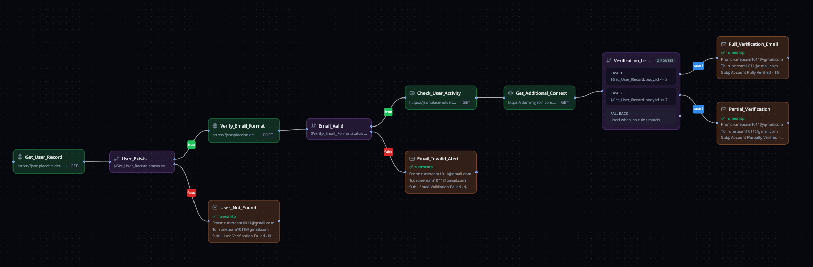
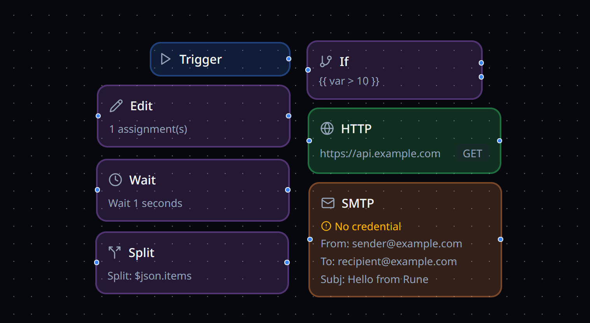
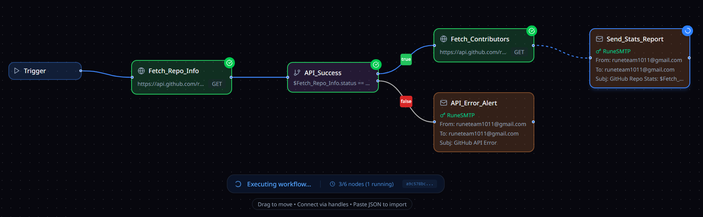

<picture>
    <source srcset="assets/logo-white.svg"  media="(prefers-color-scheme: dark)">
    <!-- markdown-link-check-disable-next-line -->
    
</picture>

<h3 align="center">Describe your workflow. <strong><em>Automate your world.</em></strong></h3>

---

Rune is an open-source workflow automation platform that lets you design, execute, and monitor complex automations through a visual interface. 

Whether you're orchestrating API calls, processing data pipelines, or building multi-step integrations, Rune makes it simple to go from idea to execution.

We built Rune because automation shouldn't require a degree in distributed systems. Connect your services, define your logic, and let Rune handle the rest.

<p align="center">
  
</p>

---

## Table of Contents

- [Features](#features)
- [Quick Start](#quick-start)
- [Architecture](#architecture)
- [Development](#development)
- [Why Rune?](#why-rune)
- [Contributing](#contributing)
- [License](#license)

---

## Features

**Visual Workflow Designer:**
Build automations by dragging and dropping nodes onto a canvas. Connect them visually, configure their behavior, and watch your workflow come to life.

<p align="center">
  
</p>

**Extensible Node System:**
A growing library of nodes for API calls, conditional logic, parallel execution, data transformation, and more. Each node is a composable building block that handles one job well.

<p align="center">
  
</p>

**Real-Time Execution Monitoring:**
Watch your workflows execute node-by-node with live WebSocket updates. Debug issues as they happen, not after the fact.

<p align="center">
  
</p>

**AI Assistants**

<table>
<tr>
<td width="80" align="center">
<picture>
<source srcset="assets/smith_white.svg" media="(prefers-color-scheme: dark)">

</picture>
</td>
<td><strong>Smith</strong> - Describe what you want in plain English. Smith translates your intent into a working workflow definition. Iterate through conversation until it's exactly right.</td>
</tr>
<tr>
<td width="80" align="center">
<picture>
<source srcset="assets/scryb_white.svg" media="(prefers-color-scheme: dark)">

</picture>
</td>
<td><strong>Scryb</strong> - Automatically generate documentation for your workflows. Scryb analyzes your automation and produces clear, readable explanations tailored to your audience.</td>
</tr>
</table>

**Secure Credential Management:**
Store API keys, OAuth tokens, and secrets with encryption at rest. Share credentials with team members without exposing sensitive values.

**Collaboration Built In:**
Share workflows with granular permissions. Owners, editors, and viewers each see what they need. Full audit trail for compliance.

---

## Quick Start

The fastest way to get Rune running is with Docker:

```bash
# Clone the repository
git clone https://github.com/rune-org/rune.git
cd rune

# Copy the environment template and set your variables
cp .env.example .env

# Start all services
make up
```

Once the containers are running, open `http://localhost:3000` in your browser.

### What Gets Started

| Service | Port | Description |
|---------|------|-------------|
| Frontend | 3000 | Web application |
| API | 8000 | REST API |
| RTES | 8080 | Real-time execution streaming |
| PostgreSQL | 5432 | Primary database |
| MongoDB | 27017 | Execution history |
| Redis | 6379 | State and caching |
| RabbitMQ | 5672 / 15672 | Message broker |

### Stopping Services

```bash
make down
```

---

## Architecture

Rune follows a polyglot microservices architecture, using the right tool for each job:

- **API (Python/FastAPI)** - Handles authentication, workflow CRUD, credential management, and orchestration
- **Worker (Go)** - Executes workflows recursively, node by node, with fault tolerance
- **RTES (Rust)** - Streams execution state in real-time over WebSockets
- **Frontend (Next.js/React)** - Visual canvas built on React Flow

---

## Development

### Prerequisites

The API service requires **uv** for dependency management:

```bash
pip install uv
```

See [uv installation guide](https://docs.astral.sh/uv/getting-started/installation/) for other methods.

For local development with hot reloading:

```bash
# Start infrastructure (Postgres, Redis, RabbitMQ, MongoDB)
make dev-infra-up

# In separate terminals, start each service:
make web-dev      # Frontend on :3000
make api-dev      # API on :8000
make worker-dev   # Background worker
```

### Project Structure

```
rune/
├── apps/
│   └── web/                 # Next.js frontend
├── services/
│   ├── api/                 # FastAPI backend
│   ├── rune-worker/         # Go execution engine
│   └── rtes/                # Rust real-time service
└── docker-compose.yml
```

---

## Why Rune?

In ancient times, runes were symbols of power, symbols of magic, each one encoding knowledge that could be combined to express complex ideas. Rune, the platform, follows the same philosophy: simple, composable building blocks that combine into something greater.

But beyond the name, we built Rune because:

**Automation should be accessible.** You shouldn't need to understand message queues, distributed locking, or retry patterns to automate a business process. Rune handles the infrastructure so you can focus on the logic.

**Visibility matters.** When something goes wrong at 2 AM, you need to know exactly which step failed and why. Real-time monitoring and full execution history make debugging straightforward.

**Security isn't optional.** Credentials encrypted at rest, role-based access control, and audit logging come standard. Not as an enterprise add-on.

**Open source wins.** Your automation platform shouldn't be a black box you can't inspect, extend, or self-host.

---

## Contributing

We welcome contributions of all kinds. Whether it's fixing a bug, improving documentation, or proposing a new feature, read the **[Contributing Guide](CONTRIBUTING.md)** to get started.

---

## License

Rune is open source software. See [LICENSE](LICENSE) for more details.
