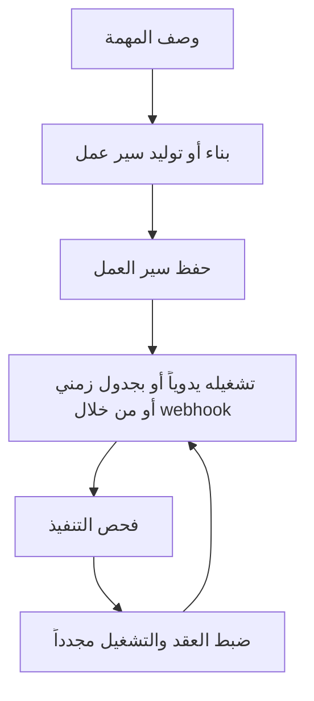

# التثبيت

استخدم هذه الصفحة عندما تحتاج إلى تشغيل Rune بنفسك. إذا كان شخص ما قد منحك بالفعل حق الوصول إلى مساحة عمل Rune، يمكنك الانتقال مباشرةً إلى [البدء السريع](/docs/getting-started/quick-start).

يتبع مسار التثبيت أدناه ملف README للمشروع.

## تشغيل Rune مع Docker

أسرع طريقة لتشغيل Rune محلياً هي استخدام Docker:

```bash
git clone https://github.com/rune-org/rune.git
cd rune

cp .env.example .env
make up
```

عند تشغيل الحاويات، افتح:

```text
http://localhost:3000
```

## ما يبدأ تشغيله

يبدأ `make up` تشغيل مجموعة Rune الكاملة:

| الخدمة | المنفذ | ما تفعله |
| --- | --- | --- |
| Frontend | `3000` | تطبيق الويب ولوحة سير العمل |
| API | `8000` | واجهة برمجة تطبيقات REST للمصادقة وسير العمل وبيانات الاعتماد والقوالب والتنسيق |
| RTES | `8080` | بث التنفيذ في الوقت الفعلي |
| Worker | غير محدد | محرك تنفيذ سير العمل في الخلفية |
| Archivist | غير محدد | مسجّل الإكمال ومشغّل البيانات |
| Scheduler | غير محدد | خدمة تشغيل سير العمل المجدوَل |
| PostgreSQL | `5432` | قاعدة البيانات الأساسية |
| MongoDB | `27017` | سجل التنفيذ |
| Redis | `6379` | الحالة والتخزين المؤقت |
| RabbitMQ | `5672` / `15672` | وسيط الرسائل |
| OpenObserve | `5080` | منصة المراقبة |
| OpenTelemetry | `4317` / `4318` | جامع بيانات القياس عن بُعد |

## إيقاف Rune

من جذر المستودع، شغّل:

```bash
make down
```

## بعد التثبيت

بمجرد فتح تطبيق الويب، يبدو تدفق المنتج كما يلي:



الخطوات التالية:

1. اتبع [البدء السريع](/docs/getting-started/quick-start).
2. اقرأ [كيف يعمل Rune](/docs/how-rune-works) عندما يبدو مصطلح غير مألوف.
3. استخدم [عائلات العقد](/docs/guides/nodes) لاختيار النوع الصحيح من الخطوات.
4. أضف [بيانات الاعتماد](/docs/guides/credentials) عندما يحتاج سير عملك إلى خدمات خاصة.
