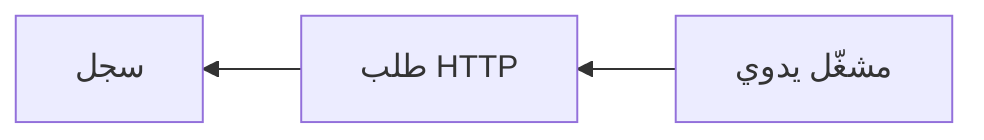

# البدء السريع

ابنِ وشغّل سير عملك الأول دون إعداد أي حسابات خارجية.

ستنشئ هذا التدفق:



## 1. إنشاء سير عمل

1. افتح **إنشاء**.
2. اختر **البدء من الصفر**.
3. إذا طُلب منك، سمّ سير العمل بشيء مثل `First API Demo`.

## 2. إضافة المشغّل

يبدأ كل سير عمل بمشغّل.

استخدم **مشغّلاً يدوياً** لهذا العرض التوضيحي. يتيح لك بدء سير العمل بنفسك متى كنت مستعداً.

## 3. إضافة عقدة طلب HTTP

أضف عقدة **طلب HTTP** وصلها بالمشغّل اليدوي.

قم بتهيئتها بـ:

- **الطريقة:** `GET`
- **عنوان URL:** `https://api.github.com/zen`
- **المهلة الزمنية:** احتفظ بالإعداد الافتراضي ما لم يكن لديك سبب لتغييره.

تُعيد هذه النقطة النهائية العامة استجابة نصية قصيرة، مما يجعلها مفيدة للتعلم دون بيانات اعتماد.

## 4. إضافة عقدة سجل

أضف عقدة **سجل** وصلها بعقدة طلب HTTP.

اضبط الرسالة على:

```text
GitHub Zen says: $HTTP.body
```

إذا أعدت تسمية عقدة HTTP، استخدم اسم تلك العقدة في مرجع المتغير.

## 5. الحفظ والتشغيل

1. احفظ سير العمل.
2. انقر على **تشغيل**.
3. انتظر حتى تنتهي عملية التنفيذ.

## 6. فحص النتيجة

افتح تفاصيل التنفيذ من اللوحة أو صفحة **عمليات التنفيذ**.

ابحث عن:

- حالة طلب HTTP.
- نص الاستجابة من واجهة برمجة التطبيقات العامة.
- مخرجات عقدة السجل.

## ما تعلمته

- يبدأ المشغّل سير العمل.
- العقد تقوم بالعمل.
- الاتصالات تحدد الترتيب.
- يمكن للعقد اللاحقة استخدام البيانات من العقد السابقة.
- تُظهر عمليات التنفيذ ما حدث أثناء التشغيل.

بعد ذلك، اقرأ [كيف يعمل Rune](/docs/how-rune-works) أو استكشف [عائلات العقد](/docs/guides/nodes).
