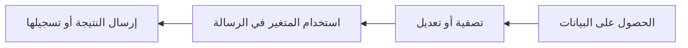

# البيانات والمتغيرات

تنتقل بيانات سير العمل من عقدة إلى أخرى. عندما تنتج عقدة مخرجات، يمكن للعقد اللاحقة استخدام تلك المخرجات.

## كيف تبدو البيانات

تُعيد العقد المختلفة أشكالاً مختلفة:

- قد يُعيد طلب HTTP حالةً ورؤوساً ونصاً أساسياً.
- تُعيد عقدة Filter العناصر المطابقة.
- تُعيد عقدة Agent استجابةً.
- تسجّل عقدة Log رسالةً.

استخدم تفاصيل التنفيذ لرؤية المخرجات الفعلية من عقدة بعد التشغيل.

## مراجع المتغيرات

استخدم المتغيرات عندما تحتاج عقدة لاحقة إلى بيانات من عقدة سابقة.

مثال:

```text
The API returned: $GetData.body
```

يعتمد اسم المتغير الدقيق على تسمية العقدة. التسميات الواضحة تجعل مراجع المتغيرات أسهل للقراءة.

## عادات عملية

- أعد تسمية العقد المهمة قبل الإشارة إلى مخرجاتها.
- شغّل بعد كل خطوة بيانات جديدة حتى تتمكن من فحص الشكل.
- استخدم عقد Log أثناء البناء لجعل البيانات المخفية مرئية.
- احتفظ ببيانات الاختبار صغيرة حتى يتصرف سير العمل بشكل صحيح.

## النمط الشائع



## استكشاف أخطاء المتغيرات

إذا لم يُحلَّ متغير:

1. تأكد من أن العقدة المنبعثة اتجاهاً نفّذت بنجاح.
2. تحقق من تسمية العقدة المستخدمة في المتغير.
3. افحص مخرجات التنفيذ لإيجاد اسم الحقل.
4. أضف عقدة Log مؤقتاً لطباعة القيمة.
