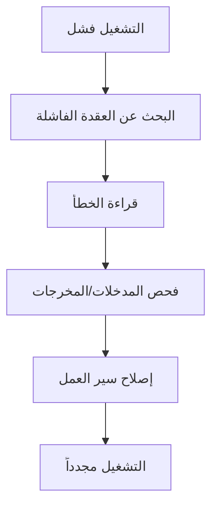

# مراقبة عمليات التنفيذ

عملية التنفيذ هي تشغيل واحد لسير العمل.

استخدم عمليات التنفيذ لمعرفة ما إذا اكتمل سير العمل، وأين فشل، وما أنتجته كل عقدة.

## أين تجد عمليات التنفيذ

يمكنك مراجعة عمليات التنفيذ من:

- لوحة سير العمل بعد التشغيل.
- صفحة **عمليات التنفيذ**، التي تسرد التشغيلات الأخيرة عبر سير العمل.
- الروابط من صفوف سير العمل أو سجل التشغيل.

## أساسيات الحالة

تشمل حالات التنفيذ الشائعة:

- **قيد التشغيل:** لا يزال Rune يعمل على سير العمل.
- **مكتمل:** اكتمل سير العمل بنجاح.
- **فشل:** أوقفت عقدة واحدة أو أكثر التشغيل.

## تصحيح تشغيل فاشل

1. افتح عملية التنفيذ الفاشلة.
2. ابحث عن أول عقدة فاشلة.
3. اقرأ خطأ العقدة.
4. افحص المدخلات والمخرجات حول تلك العقدة.
5. أصلح سير العمل أو بيانات الاعتماد.
6. احفظ وشغّل مجدداً.

## استخدام السجلات أثناء البناء

أضف عقد Log عندما تريد رؤية القيم أثناء التشغيل.

السجلات مفيدة بشكل خاص أثناء تعلم مراجع المتغيرات أو التحقق من البيانات من استجابة واجهة برمجة تطبيقات.

## الأسباب الشائعة للأعطال

- بيانات اعتماد مفقودة أو منتهية الصلاحية أو لم تعد مشتركة.
- عنوان URL أو حقل أو اسم متغير خاطئ.
- أعادت واجهة برمجة التطبيقات حالة 4xx أو 5xx.
- لم تتطابق شرط الفرع مع البيانات المتوقعة.
- تم تحرير سير العمل لكن لم يُحفظ قبل التشغيل.
