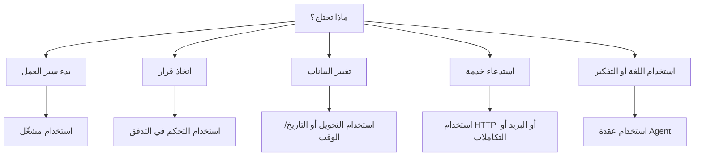

# عائلات العقد

العقد هي اللبنات الأساسية لسير عمل Rune. يشرح هذا الدليل عائلات العقد الرئيسية ومتى تستخدمها.

## المشغّلات

تبدأ المشغّلات سير العمل.

- **المشغّل اليدوي:** شغّل سير العمل بنفسك.
- **المشغّل المجدوَل:** شغّل بشكل متكرر على فترات منتظمة.
- **مشغّل webhook:** ابدأ من حدث HTTP خارجي.

تبدأ معظم سير العمل بمشغّل في بداية التدفق.

## التحكم في التدفق

عقد التدفق تقرر ما يحدث بعد ذلك.

- **If:** ينقسم إلى مسارات صحيح وخطأ.
- **Switch:** يوجّه بناءً على قواعد متعددة.
- **Wait:** يتوقف مؤقتاً قبل المتابعة.
- **Merge:** يجمع الفروع معاً.
- **Log:** يكتب مخرجات مفيدة أثناء التشغيل.

استخدم التحكم في التدفق عندما يحتاج سير العمل إلى قرارات أو تأخيرات أو مخرجات تصحيح.

## التحويل

تعيد عقد التحويل تشكيل البيانات قبل أن تستخدمها خطوة أخرى.

- **Edit:** إنشاء حقول أو تغييرها.
- **Filter:** الاحتفاظ فقط بالعناصر المطابقة.
- **Sort:** ترتيب قائمة.
- **Limit:** الاحتفاظ بالمجموعة الأولى من العناصر.
- **Split:** معالجة العناصر واحداً تلو الآخر.
- **Aggregator:** جمع العناصر معاً.

استخدم عقد التحويل بين مصادر البيانات والإجراءات.

## التاريخ والوقت

تنشئ عقد التاريخ/الوقت الطوابع الزمنية وتحللها وتضبطها وتنسّقها.

استخدمها للتذكيرات والجداول الزمنية والمواعيد النهائية والتقارير والرسائل المدركة لتوقيت المناطق الزمنية.

## HTTP والبريد الإلكتروني

- **طلب HTTP:** استدعاء واجهة برمجة تطبيقات.
- **بريد SMTP:** إرسال بريد إلكتروني.

تحتاج هذه العقد في الغالب إلى بيانات اعتماد عندما تكون الخدمة المستهدفة خاصة.

## وكلاء الذكاء الاصطناعي

يمكن لعقدة **Agent** استخدام نموذج ورسائل وأدوات وسياق لإنتاج استجابة.

استخدم وكيلاً عندما تحتاج خطوة إلى فهم اللغة أو التلخيص أو الصياغة أو التصنيف أو التفكير المرن.

## التكاملات

تتصل عقد التكامل بخدمات مثل Google وJira وMicrosoft وSlack وTelegram وDropbox عندما تكون هذه الأدوات متاحة في التطبيق.

استخدم التكاملات عندما تريد إجراءً خاصاً بالخدمة بدلاً من طلب HTTP عام.

## الملاحظات

عقدة **Note** مخصصة للتوثيق على اللوحة. لا تُنفَّذ ولا تغيّر بيانات سير العمل.

استخدم الملاحظات لشرح الفروع المعقدة أو الافتراضات أو تفاصيل التسليم لزملائك في الفريق.

## اختيار العقدة الصحيحة

