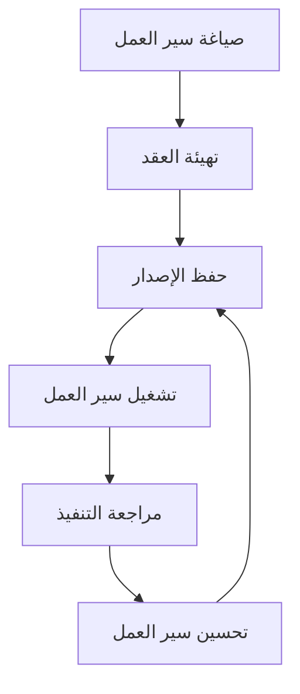

# كيف يعمل Rune

سير عمل Rune هي عمليات أتمتة بصرية. تبنيها بوضع العقد على اللوحة وتوصيلها بالترتيب الذي يجب أن تُنفَّذ فيه.

## المفاهيم الأساسية

### سير العمل

سير العمل هو الأتمتة الكاملة: اسمه ووصفه وعقده وتوصيلاته والإصدارات المحفوظة.

استخدم سير العمل لمهمة قابلة للتكرار، مثل استعلام واجهة برمجة التطبيقات، أو تحويل قائمة، أو إرسال بريد إلكتروني، أو توجيه العمل بناءً على شروط.

إذا كنت تشغّل Rune محلياً للمرة الأولى، ابدأ بـ[التثبيت](/docs/getting-started). إذا كان Rune يعمل بالفعل، ابدأ بـ[البدء السريع](/docs/getting-started/quick-start).

### المشغّلات

يبدأ المشغّل سير العمل.

يتضمن Rune:

- **المشغّل اليدوي** لسير العمل الذي تبدأه بنفسك.
- **المشغّل المجدوَل** لسير العمل الذي يعمل على فترات منتظمة.
- **مشغّل webhook** لسير العمل الذي يبدأ عندما يرسل خدمة أخرى حدثاً.

### العقد

العقد هي الخطوات داخل سير العمل. يمكن للعقدة استدعاء واجهة برمجة تطبيقات، أو تصفية البيانات، أو إرسال بريد إلكتروني، أو الانتظار، أو التفرع، أو طلب الرد من وكيل ذكاء اصطناعي.

تحتوي معظم العقد على مدخلات ومخرجات وإعدادات تحررها في المفتش.

### الاتصالات

تخبر الاتصالات Rune بما يجب أن يحدث بعد ذلك.

### البيانات والمتغيرات

عندما تُنفَّذ عقدة، يمكنها إنتاج مخرجات. يمكن للعقد اللاحقة استخدام تلك المخرجات بمراجع المتغيرات.

على سبيل المثال، يمكن لعقدة السجل تضمين النص الأساسي الذي أعادته عقدة طلب HTTP.

### بيانات الاعتماد

تخزّن بيانات الاعتماد الأسرار والرموز المميزة واتصالات الحسابات. استخدمها عندما يحتاج سير العمل إلى استدعاء واجهة برمجة تطبيقات أو خدمة خاصة.

يحتفظ Rune بقيم بيانات الاعتماد خارج رسم بياني سير العمل حتى تتمكن من إعادة استخدام سير العمل ومشاركته بأمان أكبر.

### عمليات التنفيذ

عملية التنفيذ هي تشغيل واحد لسير العمل.

استخدم عمليات التنفيذ للإجابة على:

- هل اكتمل سير العمل؟
- أي عقدة فشلت؟
- ما البيانات التي استلمتها عقدة أو أعادتها؟
- متى حدث التشغيل؟

### القوالب

القوالب هي نقاط بداية قابلة لإعادة الاستخدام لسير العمل. استخدمها عندما تريد هيكلاً مجرَّباً تخطط لتخصيصه.

### Smith وScryb

**Smith** يساعدك على بناء سير العمل من التعليمات البرمجية بلغة طبيعية.

**Scryb** يولّد توثيق Markdown لسير العمل المحفوظ حتى تتمكن من شرح ما يفعله سير العمل وكيف يتصل.

## دورة حياة سير العمل

## ما يجب قراءته بعد ذلك

- [البدء السريع](/docs/getting-started/quick-start) للتشغيل الأول.
- [إنشاء سير العمل](/docs/guides/creating-workflows) لعادات اللوحة.
- [عمليات التنفيذ](/docs/guides/executions) لسجل التشغيل والأعطال.
