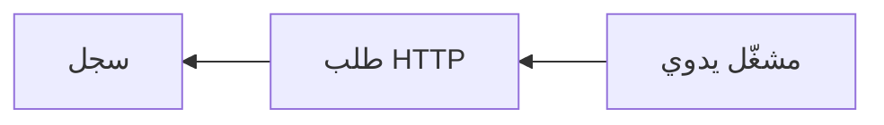

# توثيق Rune

يساعدك Rune على بناء عمليات الأتمتة كسير عمل: قم بتوصيل مشغّل، وأضف خطوات، وشغّل سير العمل، ثم راقب ما حدث.

كُتب هذا التوثيق للأشخاص الذين يستخدمون تطبيق Rune. لا تحتاج إلى معرفة الواجهة الخلفية أو إعداد النشر أو الكود المُولَّد للبدء.

## ابدأ من هنا

1. إذا كنت بحاجة إلى تشغيل Rune بنفسك، ابدأ بـ[التثبيت](/docs/getting-started).
2. إذا كان Rune متاحاً لك بالفعل، اتبع [البدء السريع](/docs/getting-started/quick-start) لتشغيل سير عمل لا يتطلب بيانات اعتماد.
3. استخدم [الأدلة](/docs/guides/creating-workflows) عندما تريد توصيل الخدمات، أو العمل مع البيانات، أو استخدام القوالب، أو فهم عمليات التنفيذ الفاشلة.

## ما يمكنك فعله مع Rune

- بناء سير عمل من الصفر على لوحة رسم بصرية.
- البدء بشكل أسرع من القوالب.
- طلب من Smith صياغة سير عمل من وصف بلغة طبيعية.
- توصيل واجهات برمجة التطبيقات والخدمات ببيانات الاعتماد.
- مراقبة عمليات التنفيذ وفحص كل تشغيل.
- استخدام Scryb لتوليد توثيق Markdown لسير عمل محفوظ.

## سير العمل الأول

أسرع طريق هو عرض توضيحي بدون بيانات اعتماد:

يستدعي واجهة برمجة تطبيقات عامة، ويسجّل الاستجابة، ويمنحك فكرة عن كيفية تدفق البيانات عبر Rune.

تابع مع [البدء السريع](/docs/getting-started/quick-start).
