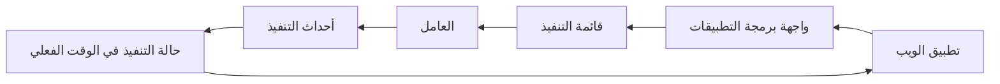

# البنية المعمارية

هذه الصفحة مخصصة للمطورين والمشغّلين الذين يحتاجون إلى سياق التنفيذ.

يبدأ إعداد المستخدمين في [توثيق Rune](/docs).

## نظرة عامة على النظام

يتكون Rune من:

- تطبيق ويب Next.js لواجهة المستخدم ولوحة سير العمل.
- خدمة FastAPI للمستخدمين وسير العمل وبيانات الاعتماد والقوالب وOAuth ونقاط النهاية الداخلية.
- عامل Go يُنفّذ عقد سير العمل.
- خدمة تنفيذ Rust في الوقت الفعلي لحالة التنفيذ والتحديثات المباشرة.
- خدمات Python لتسجيل الإكمال واستطلاع سير العمل المجدوَل.
- DSL محايد اللغة يحدد هياكل سير العمل المشتركة عبر الخدمات.

## مسار جانب المستخدم

من وجهة نظر المستخدم:

للحصول على إرشادات التنفيذ على مستوى المستودع، راجع `AGENTS.md` وملفات README للخدمات.
