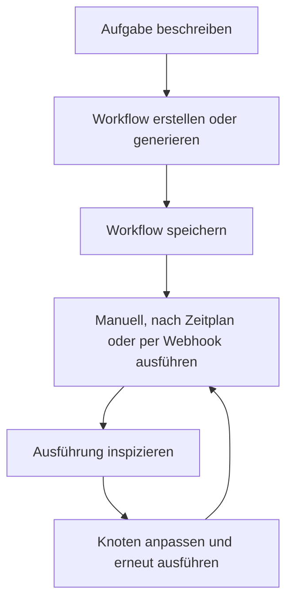

# Installation

Nutze diese Seite, wenn du Rune selbst betreiben möchtest. Wenn jemand dir bereits Zugang zu einem Rune-Arbeitsbereich gegeben hat, kannst du direkt zum [Schnellstart](/docs/getting-started/quick-start) übergehen.

Der unten beschriebene Installationsweg folgt dem Projekt-README.

## Rune mit Docker ausführen

Der schnellste Weg, Rune lokal zum Laufen zu bringen, ist mit Docker:

```bash
git clone https://github.com/rune-org/rune.git
cd rune

cp .env.example .env
make up
```

Wenn die Container laufen, öffne:

```text
http://localhost:3000
```

## Was gestartet wird

`make up` startet den vollständigen Rune-Stack:

| Dienst | Port | Aufgabe |
| --- | --- | --- |
| Frontend | `3000` | Web-App und Workflow-Canvas |
| API | `8000` | REST-API für Auth, Workflows, Zugangsdaten, Vorlagen und Orchestrierung |
| RTES | `8080` | Echtzeit-Ausführungs-Streaming |
| Worker | N/A | Hintergrund-Workflow-Ausführungsmotor |
| Archivist | N/A | Abschluss-Recorder und Datenpfleger |
| Scheduler | N/A | Dienst für geplante Workflow-Trigger |
| PostgreSQL | `5432` | Primäre Datenbank |
| MongoDB | `27017` | Ausführungsverlauf |
| Redis | `6379` | Zustand und Caching |
| RabbitMQ | `5672` / `15672` | Message-Broker |
| OpenObserve | `5080` | Observability-Plattform |
| OpenTelemetry | `4317` / `4318` | Telemetrie-Collector |

## Rune stoppen

Führe im Repository-Stammverzeichnis aus:

```bash
make down
```

## Nach der Installation

Wenn die Web-App geöffnet ist, sieht der Produktfluss so aus:



Nächste Schritte:

1. Führe den [Schnellstart](/docs/getting-started/quick-start) durch.
2. Lies [So funktioniert Rune](/docs/how-rune-works), wenn ein Begriff unklar ist.
3. Nutze [Knotenfamilien](/docs/guides/nodes), um den richtigen Schritttyp zu wählen.
4. Füge [Zugangsdaten](/docs/guides/credentials) hinzu, wenn dein Workflow private Dienste benötigt.
