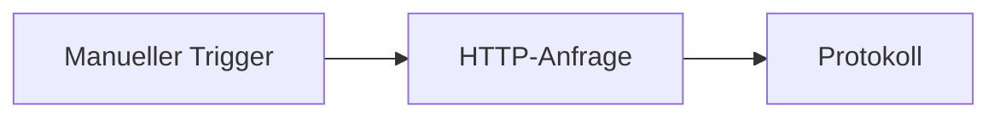

# Schnellstart

Erstelle und führe deinen ersten Workflow aus, ohne externe Konten einzurichten.

Du wirst diesen Ablauf erstellen:



## 1. Einen Workflow erstellen

1. Öffne **Erstellen**.
2. Wähle **Von Grund auf starten**.
3. Wenn du aufgefordert wirst, benenne den Workflow z. B. `First API Demo`.

## 2. Den Trigger hinzufügen

Jeder Workflow beginnt mit einem Trigger.

Verwende für diese Demo einen **Manuellen Trigger**. Er lässt dich den Workflow selbst starten, wann immer du bereit bist.

## 3. Einen HTTP-Anfrage-Knoten hinzufügen

Füge einen **HTTP-Anfrage**-Knoten hinzu und verbinde den Manuellen Trigger damit.

Konfiguriere ihn mit:

- **Methode:** `GET`
- **URL:** `https://api.github.com/zen`
- **Timeout:** behalte den Standardwert bei, es sei denn, du hast einen Grund, ihn zu ändern.

Dieser öffentliche Endpunkt gibt eine kurze Textantwort zurück, was ihn nützlich zum Lernen ohne Zugangsdaten macht.

## 4. Einen Protokoll-Knoten hinzufügen

Füge einen **Protokoll**-Knoten hinzu und verbinde den HTTP-Anfrage-Knoten damit.

Setze die Nachricht auf:

```text
GitHub Zen says: $HTTP.body
```

Wenn du den HTTP-Knoten umbenannt hast, verwende diesen Knotennamen in der Variablenreferenz.

## 5. Speichern und ausführen

1. Speichere den Workflow.
2. Klicke auf **Ausführen**.
3. Warte, bis die Ausführung abgeschlossen ist.

## 6. Das Ergebnis inspizieren

Öffne die Ausführungsdetails vom Canvas oder der Seite **Ausführungen**.

Achte auf:

- Den Status der HTTP-Anfrage.
- Den Antwort-Body der öffentlichen API.
- Die Ausgabe des Protokoll-Knotens.

## Was du gelernt hast

- Ein Trigger startet den Workflow.
- Knoten erledigen die Arbeit.
- Verbindungen bestimmen die Reihenfolge.
- Spätere Knoten können Daten früherer Knoten verwenden.
- Ausführungen zeigen, was während eines Laufs passiert ist.

Lies als Nächstes [So funktioniert Rune](/docs/how-rune-works) oder erkunde die [Knotenfamilien](/docs/guides/nodes).
