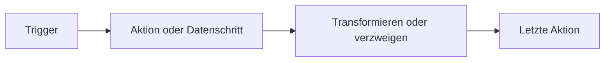

# Workflows erstellen

Erstelle einen Workflow, wenn du eine Aufgabe hast, die Rune wiederholen soll.

## Einen Ausgangspunkt wählen

Rune bietet dir drei gängige Ausgangspunkte:

- **Von Grund auf starten**, wenn du die gewünschten Schritte kennst.
- **Eine Vorlage verwenden**, wenn bereits ein ähnlicher Workflow existiert.
- **Einen Agenten fragen**, wenn Smith die erste Version aus einem Prompt entwerfen soll.

## Auf dem Canvas aufbauen

Der Canvas ist der Ort, an dem du Knoten anordnest und verbindest.

1. Füge einen Trigger hinzu.
2. Füge den ersten Aktions- oder Datenschritt hinzu.
3. Verbinde den Trigger mit diesem Schritt.
4. Füge weiter Knoten hinzu, bis der Workflow sein Ziel erreicht.
5. Speichere vor dem Ausführen.



## Knoten klar benennen

Kurze Namen machen Variablenreferenzen später leichter lesbar.

Gute Knotennamen:

- `Get customer`
- `Filter overdue invoices`
- `Send summary`

Vermeide Namen wie `HTTP 1` oder `Step 2`, sobald der Workflow zu wachsen beginnt.

## Oft speichern und versionieren

Speichere vor dem Ausführen und erneut nach wesentlichen Änderungen.

Wenn ein anderer Editor den Workflow ändert, während du arbeitest, kann Rune dich bitten, den Versionskonflikt vor dem Speichern zu lösen.

## Klein ausführen, dann erweitern

Für einen neuen Workflow:

1. Führe mit einem kleinen Testfall aus.
2. Inspiziere die Ausführung.
3. Behebe jeweils ein Problem.
4. Füge den nächsten Knoten erst hinzu, wenn der aktuelle Pfad funktioniert.

Das macht Fehler leichter verständlich.

## Wann Smith verwenden

Verwende Smith, wenn du das Ergebnis beschreiben kannst, aber den ersten Graphen nicht manuell zusammenstellen möchtest.

Beispiel-Prompt:

```text
Build a workflow that receives a webhook, checks whether the payload has a high priority flag, and sends a Slack notification when it does.
```

Überprüfe den generierten Workflow immer, bevor du ihn für wichtige Arbeit einsetzt.
