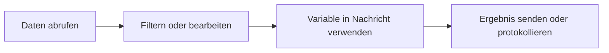

# Daten und Variablen

Workflow-Daten bewegen sich von Knoten zu Knoten. Wenn ein Knoten eine Ausgabe produziert, können spätere Knoten diese Ausgabe verwenden.

## Wie Daten aussehen

Verschiedene Knoten geben unterschiedliche Formen zurück:

- Eine HTTP-Anfrage kann einen Status, Header und Body zurückgeben.
- Ein Filter-Knoten gibt übereinstimmende Elemente zurück.
- Ein Agent-Knoten gibt eine Antwort zurück.
- Ein Protokoll-Knoten zeichnet eine Nachricht auf.

Nutze die Ausführungsdetails, um die tatsächliche Ausgabe eines Knotens nach einem Lauf zu sehen.

## Variablenreferenzen

Verwende Variablen, wenn ein späterer Knoten Daten von einem früheren Knoten benötigt.

Beispiel:

```text
The API returned: $GetData.body
```

Der genaue Variablenname hängt von der Knotenbezeichnung ab. Klare Bezeichnungen machen Variablenreferenzen leichter lesbar.

## Praktische Gewohnheiten

- Benenne wichtige Knoten um, bevor du ihre Ausgabe referenzierst.
- Führe nach jedem neuen Datenschritt aus, um die Form inspizieren zu können.
- Nutze Protokoll-Knoten beim Aufbau, um versteckte Daten sichtbar zu machen.
- Halte Testdaten klein, bis der Workflow sich korrekt verhält.

## Häufiges Muster



## Variablen debuggen

Wenn eine Variable nicht aufgelöst wird:

1. Bestätige, dass der vorgelagerte Knoten erfolgreich ausgeführt wurde.
2. Überprüfe die im Variablennamen verwendete Knotenbezeichnung.
3. Inspiziere die Ausführungsausgabe nach dem Feldnamen.
4. Füge vorübergehend einen Protokoll-Knoten hinzu, um den Wert auszugeben.
