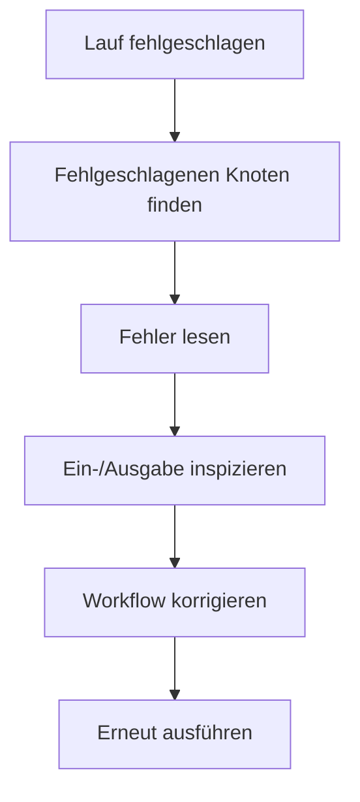

# Ausführungen überwachen

Eine Ausführung ist ein einzelner Lauf eines Workflows.

Nutze Ausführungen, um zu sehen, ob der Workflow abgeschlossen wurde, wo er fehlgeschlagen ist und was jeder Knoten produziert hat.

## Wo Ausführungen zu finden sind

Du kannst Ausführungen überprüfen von:

- Dem Workflow-Canvas nach einem Lauf.
- Der Seite **Ausführungen**, die aktuelle Läufe aller Workflows auflistet.
- Links aus Workflow-Zeilen oder dem Laufverlauf.

## Statusgrundlagen

Häufige Ausführungszustände sind:

- **Läuft:** Rune arbeitet noch am Workflow.
- **Abgeschlossen:** der Workflow wurde erfolgreich beendet.
- **Fehlgeschlagen:** ein oder mehrere Knoten haben den Lauf gestoppt.

## Einen fehlgeschlagenen Lauf debuggen

1. Öffne die fehlgeschlagene Ausführung.
2. Finde den ersten fehlgeschlagenen Knoten.
3. Lies den Knotenfehler.
4. Inspiziere Ein- und Ausgabe rund um diesen Knoten.
5. Korrigiere den Workflow oder die Zugangsdaten.
6. Speichere und führe erneut aus.

## Protokolle beim Aufbau nutzen

Füge Protokoll-Knoten hinzu, wenn du Werte während eines Laufs sehen möchtest.

Protokolle sind besonders nützlich, während du Variablenreferenzen lernst oder Daten aus einer API-Antwort prüfst.

## Häufige Fehlerursachen

- Eine Zugangsdaten sind fehlend, abgelaufen oder nicht mehr geteilt.
- Eine URL, ein Feld oder ein Variablenname ist falsch.
- Eine API hat einen 4xx- oder 5xx-Status zurückgegeben.
- Eine Verzweigungsbedingung stimmte nicht mit den erwarteten Daten überein.
- Ein Workflow wurde bearbeitet, aber vor dem Ausführen nicht gespeichert.
