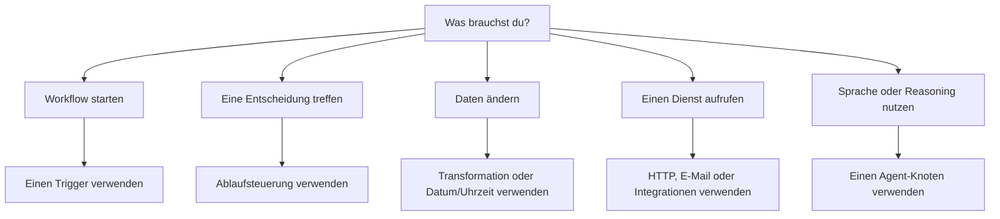

# Knotenfamilien

Knoten sind die Bausteine eines Rune-Workflows. Dieser Leitfaden erklärt die wichtigsten Knotenfamilien und wann du sie verwenden solltest.

## Trigger

Trigger starten Workflows.

- **Manueller Trigger:** führe den Workflow selbst aus.
- **Geplanter Trigger:** führe ihn wiederholt in einem Intervall aus.
- **Webhook-Trigger:** starte von einem externen HTTP-Ereignis aus.

Die meisten Workflows beginnen mit einem Trigger am Anfang des Flusses.

## Ablaufsteuerung

Ablaufsteuerungsknoten entscheiden, was als Nächstes passiert.

- **If:** teilt sich in wahre und falsche Pfade auf.
- **Switch:** leitet basierend auf mehreren Regeln weiter.
- **Wait:** pausiert vor dem Fortfahren.
- **Merge:** führt Zweige wieder zusammen.
- **Log:** schreibt nützliche Ausgaben während eines Laufs.

Verwende Ablaufsteuerung, wenn der Workflow Entscheidungen, Verzögerungen oder Debug-Ausgaben benötigt.

## Transformation

Transformationsknoten formen Daten um, bevor ein anderer Schritt sie verwendet.

- **Edit:** Felder erstellen oder ändern.
- **Filter:** nur übereinstimmende Elemente behalten.
- **Sort:** eine Liste sortieren.
- **Limit:** den ersten Satz von Elementen behalten.
- **Split:** Elemente einzeln verarbeiten.
- **Aggregator:** Elemente wieder sammeln.

Verwende Transformationsknoten zwischen Datenquellen und Aktionen.

## Datum und Uhrzeit

Datums-/Uhrzeitknoten erstellen, analysieren, passen an und formatieren Zeitstempel.

Nutze sie für Erinnerungen, Zeitpläne, Fälligkeitsdaten, Berichte und zeitzonenbewusste Nachrichten.

## HTTP und E-Mail

- **HTTP-Anfrage:** eine API aufrufen.
- **SMTP-E-Mail:** eine E-Mail senden.

Diese Knoten benötigen oft Zugangsdaten, wenn der Zieldienst privat ist.

## KI-Agenten

Der **Agent**-Knoten kann ein Modell, Nachrichten, Werkzeuge und Kontext nutzen, um eine Antwort zu produzieren.

Verwende einen Agent, wenn ein Schritt Sprachverständnis, Zusammenfassung, Entwurf, Klassifizierung oder flexibles Reasoning benötigt.

## Integrationen

Integrationsknoten verbinden sich mit Diensten wie Google, Jira, Microsoft, Slack, Telegram und Dropbox, wenn diese Tools in der App verfügbar sind.

Nutze Integrationen, wenn du eine dienstspezifische Aktion statt einer generischen HTTP-Anfrage möchtest.

## Notizen

Der **Note**-Knoten dient der Dokumentation auf dem Canvas. Er wird nicht ausgeführt und ändert keine Workflow-Daten.

Nutze Notizen, um verzwickte Verzweigungen, Annahmen oder Übergabedetails für Teammitglieder zu erklären.

## Den richtigen Knoten wählen

