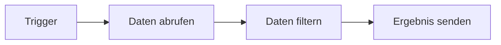
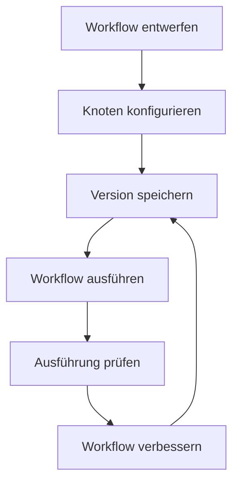

# So funktioniert Rune

Rune-Workflows sind visuelle Automatisierungen. Du baust sie, indem du Knoten auf einem Canvas platzierst und sie in der Reihenfolge verbindest, in der sie ausgeführt werden sollen.

## Grundkonzepte

### Workflows

Ein Workflow ist die vollständige Automatisierung: sein Name, seine Beschreibung, Knoten, Verbindungen und gespeicherte Versionen.

Nutze einen Workflow für eine wiederholbare Aufgabe, beispielsweise das Abfragen einer API, das Transformieren einer Liste, das Versenden einer E-Mail oder das Weiterleiten von Arbeit basierend auf Bedingungen.

Wenn du Rune zum ersten Mal lokal ausführst, beginne mit der [Installation](/docs/getting-started). Wenn Rune bereits läuft, beginne mit dem [Schnellstart](/docs/getting-started/quick-start).

### Trigger

Ein Trigger startet einen Workflow.

Rune enthält:

- **Manueller Trigger** für Workflows, die du selbst startest.
- **Geplanter Trigger** für Workflows, die in einem Intervall ausgeführt werden.
- **Webhook-Trigger** für Workflows, die starten, wenn ein anderer Dienst ein Ereignis sendet.

### Knoten

Knoten sind die Schritte innerhalb eines Workflows. Ein Knoten kann eine API aufrufen, Daten filtern, eine E-Mail senden, warten, verzweigen oder einen KI-Agenten um eine Antwort bitten.

Die meisten Knoten haben Eingaben, Ausgaben und Einstellungen, die du im Inspektor bearbeitest.

### Verbindungen

Verbindungen teilen Rune mit, was als Nächstes passieren soll.

### Daten und Variablen

Wenn ein Knoten ausgeführt wird, kann er eine Ausgabe produzieren. Spätere Knoten können diese Ausgabe mit Variablenreferenzen nutzen.

Beispielsweise kann ein Protokoll-Knoten den Body einschließen, der von einem HTTP-Anfrage-Knoten zurückgegeben wurde.

### Zugangsdaten

Zugangsdaten speichern Geheimnisse, Tokens und Kontoverbindungen. Nutze sie, wenn ein Workflow eine private API oder einen Dienst aufrufen muss.

Rune hält die Werte der Zugangsdaten außerhalb des Workflow-Graphen, damit du Workflows sicherer wiederverwenden und teilen kannst.

### Ausführungen

Eine Ausführung ist ein einzelner Lauf eines Workflows.

Nutze Ausführungen, um folgende Fragen zu beantworten:

- Wurde der Workflow abgeschlossen?
- Welcher Knoten ist fehlgeschlagen?
- Welche Daten hat ein Knoten empfangen oder zurückgegeben?
- Wann fand der Lauf statt?

### Vorlagen

Vorlagen sind wiederverwendbare Ausgangspunkte für Workflows. Nutze sie, wenn du eine bewährte Struktur möchtest, die du anpassen willst.

### Smith und Scryb

**Smith** hilft dir dabei, Workflows aus natürlichsprachigen Beschreibungen zu erstellen.

**Scryb** generiert Markdown-Dokumentation für gespeicherte Workflows, damit du erklären kannst, was ein Workflow tut und wie er verdrahtet ist.

## Workflow-Lebenszyklus

## Was als Nächstes lesen

- [Schnellstart](/docs/getting-started/quick-start) für einen ersten Lauf.
- [Workflows erstellen](/docs/guides/creating-workflows) für Canvas-Gewohnheiten.
- [Ausführungen](/docs/guides/executions) für den Verlauf und Fehlschläge.
