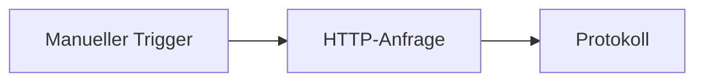

# Rune-Dokumentation

Rune hilft dir dabei, Automatisierungen als Workflows zu erstellen: Verbinde einen Trigger, füge Schritte hinzu, führe den Workflow aus und sieh nach, was passiert ist.

Diese Dokumentation richtet sich an Personen, die die Rune-App nutzen. Du musst weder das Backend noch die Deployment-Konfiguration oder den generierten Code kennen, um anzufangen.

## Hier beginnen

1. Wenn du Rune selbst betreiben möchtest, beginne mit der [Installation](/docs/getting-started).
2. Wenn Rune bereits für dich verfügbar ist, folge dem [Schnellstart](/docs/getting-started/quick-start), um einen Workflow auszuführen, der keine Zugangsdaten benötigt.
3. Nutze die [Anleitungen](/docs/guides/creating-workflows), wenn du Dienste verbinden, mit Daten arbeiten, Vorlagen nutzen oder fehlgeschlagene Ausführungen verstehen möchtest.

## Was du mit Rune tun kannst

- Workflows von Grund auf in einem visuellen Canvas erstellen.
- Mit Vorlagen schneller starten.
- Smith bitten, einen Workflow aus einer Beschreibung in natürlicher Sprache zu entwerfen.
- APIs und Dienste mit Zugangsdaten verbinden.
- Ausführungen überwachen und jeden Lauf inspizieren.
- Scryb nutzen, um Markdown-Dokumentation für einen gespeicherten Workflow zu generieren.

## Der erste Workflow

Der schnellste Weg ist eine Demo ohne Zugangsdaten:

Er ruft eine öffentliche API auf, protokolliert die Antwort und gibt dir ein Gefühl dafür, wie Daten durch Rune fließen.

Weiter mit dem [Schnellstart](/docs/getting-started/quick-start).
