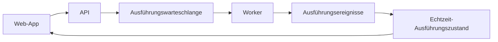

# Architektur

Diese Seite richtet sich an Entwickler und Betreiber, die Implementierungskontext benötigen.

Das Onboarding für Benutzer beginnt bei der [Rune-Dokumentation](/docs).

## Systemüberblick

Rune besteht aus:

- Einer Next.js-Web-App für die Benutzeroberfläche und den Workflow-Canvas.
- Einem FastAPI-Dienst für Benutzer, Workflows, Zugangsdaten, Vorlagen, OAuth und interne Endpunkte.
- Einem Go-Worker, der Workflow-Knoten ausführt.
- Einem Rust-Echtzeit-Ausführungsdienst für Ausführungszustand und Live-Updates.
- Python-Diensten für Abschlussaufzeichnung und geplantes Workflow-Polling.
- Einem sprachneutralen DSL, das Workflow-Strukturen definiert, die diensteübergreifend geteilt werden.

## Pfad auf Benutzerseite

Aus Benutzersicht:

Für Implementierungsanleitungen auf Repository-Ebene, siehe `AGENTS.md` und die Dienst-READMEs.
