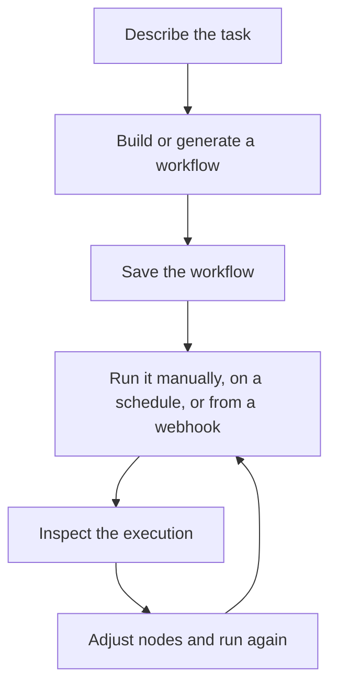

# Getting Started

Rune is organized around one main job: helping you create, run, and improve workflows.

## App areas

- **Create** is the starting point. Choose a blank workflow, a template, or Smith.
- **Workflows** lists workflows you own or can access.
- **Canvas** is where you add nodes, connect them, save versions, run the workflow, and inspect output.
- **Executions** shows workflow run history and status.
- **Credentials** stores the keys and accounts workflows need to call external services.
- **Templates** gives you reusable workflow starting points.
- **Docs** brings you back here when you need help.

## A simple mental model

## Recommended path

1. Run the [Quick Start](/docs/getting-started/quick-start).
2. Read [How Rune Works](/docs/how-rune-works) when a term feels unfamiliar.
3. Use [Node Families](/docs/guides/nodes) to choose the right kind of step.
4. Add [Credentials](/docs/guides/credentials) when your workflow needs private services.
