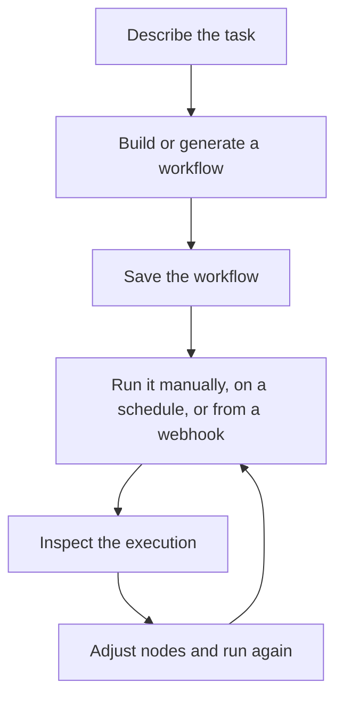

# Installation

Use this page when you need to run Rune yourself. If someone has already given you access to a Rune workspace, you can skip to the [Quick Start](/docs/getting-started/quick-start).

The installation path below follows the project README.

## Run Rune with Docker

The fastest way to get Rune running locally is with Docker:

```bash
git clone https://github.com/rune-org/rune.git
cd rune

cp .env.example .env
make up
```

When the containers are running, open:

```text
http://localhost:3000
```

## What starts

`make up` starts the full Rune stack:

| Service | Port | What it does |
| --- | --- | --- |
| Frontend | `3000` | Web app and workflow canvas |
| API | `8000` | REST API for auth, workflows, credentials, templates, and orchestration |
| RTES | `8080` | Real-time execution streaming |
| Worker | N/A | Background workflow execution engine |
| Archivist | N/A | Completion recorder and data maintainer |
| Scheduler | N/A | Scheduled workflow trigger service |
| PostgreSQL | `5432` | Primary database |
| MongoDB | `27017` | Execution history |
| Redis | `6379` | State and caching |
| RabbitMQ | `5672` / `15672` | Message broker |
| OpenObserve | `5080` | Observability platform |
| OpenTelemetry | `4317` / `4318` | Telemetry collector |

## Stop Rune

From the repository root, run:

```bash
make down
```

## After installation

Once the web app opens, the product flow looks like this:



Next steps:

1. Run the [Quick Start](/docs/getting-started/quick-start).
2. Read [How Rune Works](/docs/how-rune-works) when a term feels unfamiliar.
3. Use [Node Families](/docs/guides/nodes) to choose the right kind of step.
4. Add [Credentials](/docs/guides/credentials) when your workflow needs private services.
