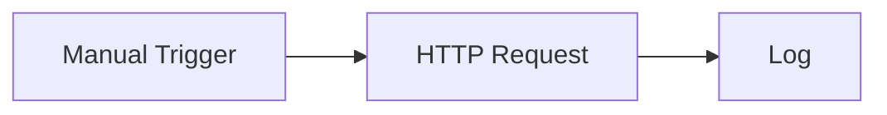

# Quick Start

Build and run your first workflow without setting up any external accounts.

You will create this flow:



## 1. Create a workflow

1. Open **Create**.
2. Choose **Start from Scratch**.
3. If prompted, name the workflow something like `First API Demo`.

## 2. Add the trigger

Every workflow starts with a trigger.

Use a **Manual Trigger** for this demo. It lets you start the workflow yourself whenever you are ready.

## 3. Add an HTTP Request node

Add an **HTTP Request** node and connect the Manual Trigger to it.

Configure it with:

- **Method:** `GET`
- **URL:** `https://api.github.com/zen`
- **Timeout:** keep the default unless you have a reason to change it.

This public endpoint returns a short text response, so it is useful for learning without credentials.

## 4. Add a Log node

Add a **Log** node and connect the HTTP Request node to it.

Set the message to:

```text
GitHub Zen says: $HTTP.body
```

If you renamed the HTTP node, use that node name in the variable reference instead.

## 5. Save and run

1. Save the workflow.
2. Click **Run**.
3. Wait for the execution to finish.

## 6. Inspect the result

Open the execution details from the canvas or the **Executions** page.

Look for:

- The HTTP Request status.
- The response body from the public API.
- The Log node output.

## What you learned

- A trigger starts the workflow.
- Nodes do the work.
- Connections decide the order.
- Later nodes can use data from earlier nodes.
- Executions show what happened during a run.

Next, read [How Rune Works](/docs/how-rune-works) or explore [Node Families](/docs/guides/nodes).
