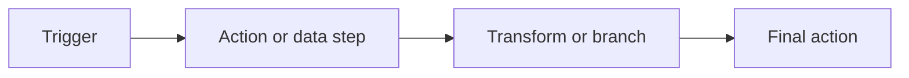

# Creating Workflows

Create a workflow when you have a task you want Rune to repeat.

## Choose a starting point

Rune gives you three common starts:

- **Start from Scratch** when you know the steps you want.
- **Use a Template** when a similar workflow already exists.
- **Ask an Agent** when you want Smith to draft the first version from a prompt.

## Build on the canvas

The canvas is where you arrange nodes and connect them.

1. Add a trigger.
2. Add the first action or data step.
3. Connect the trigger to that step.
4. Keep adding nodes until the workflow reaches its outcome.
5. Save before running.



## Name nodes clearly

Short names make variables easier to read later.

Good node names:

- `Get customer`
- `Filter overdue invoices`
- `Send summary`

Avoid names like `HTTP 1` or `Step 2` once the workflow starts to grow.

## Save and version often

Save before you run, and save again after meaningful edits.

If another editor changes the workflow while you are working, Rune may ask you to resolve the version conflict before saving.

## Run small, then expand

For a new workflow:

1. Run with a small test case.
2. Inspect the execution.
3. Fix one issue at a time.
4. Add the next node only after the current path works.

This makes failures easier to understand.

## When to use Smith

Use Smith when you can describe the outcome but do not want to assemble the first graph manually.

Example prompt:

```text
Build a workflow that receives a webhook, checks whether the payload has a high priority flag, and sends a Slack notification when it does.
```

Always review the generated workflow before using it for important work.
