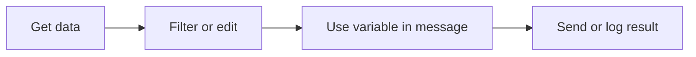

# Data and Variables

Workflow data moves from node to node. When one node produces output, later nodes can use that output.

## What data looks like

Different nodes return different shapes:

- An HTTP Request might return a status, headers, and body.
- A Filter node returns matching items.
- An Agent node returns a response.
- A Log node records a message.

Use execution details to see the real output from a node after a run.

## Variable references

Use variables when a later node needs data from an earlier node.

Example:

```text
The API returned: $GetData.body
```

The exact variable name depends on the node label. Clear labels make variable references easier to read.

## Practical habits

- Rename important nodes before you reference their output.
- Run after each new data step so you can inspect the shape.
- Use Log nodes while building to make hidden data visible.
- Keep test data small until the workflow behaves correctly.

## Common pattern



## Troubleshooting variables

If a variable does not resolve:

1. Confirm the upstream node ran successfully.
2. Check the node label used in the variable.
3. Inspect the execution output for the field name.
4. Add a Log node temporarily to print the value.
