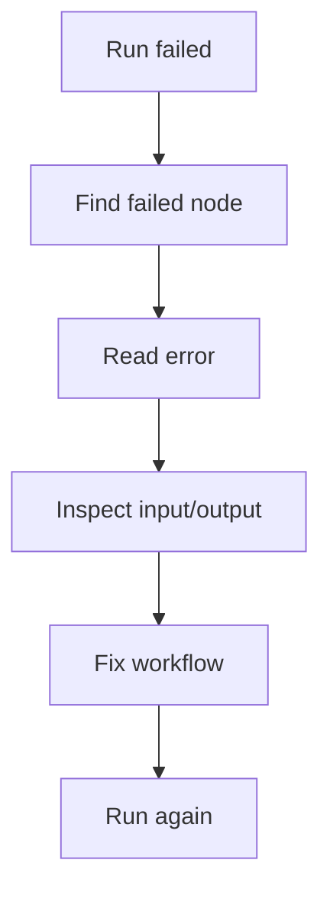

# Execution Monitoring

An execution is one run of a workflow.

Use executions to see whether the workflow finished, where it failed, and what each node produced.

## Where to find executions

You can review executions from:

- The workflow canvas after a run.
- The **Executions** page, which lists recent runs across workflows.
- Links from workflow rows or run history.

## Status basics

Common execution states include:

- **Running:** Rune is still working through the workflow.
- **Completed:** the workflow finished successfully.
- **Failed:** one or more nodes stopped the run.

## Debug a failed run

1. Open the failed execution.
2. Find the first failed node.
3. Read the node error.
4. Inspect the input and output around that node.
5. Fix the workflow or credential.
6. Save and run again.

## Use logs while building

Add Log nodes when you want to see values during a run.

Logs are especially helpful while you are learning variable references or checking data from an API response.

## Common causes of failures

- A credential is missing, expired, or no longer shared.
- A URL, field, or variable name is wrong.
- An API returned a 4xx or 5xx status.
- A branch condition did not match the data you expected.
- A workflow was edited but not saved before running.
