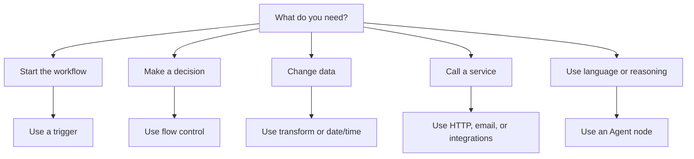

# Node Families

Nodes are the building blocks of a Rune workflow. V1 docs explain node families and common uses, not every field on every node.

## Triggers

Triggers start workflows.

- **Manual Trigger:** run the workflow yourself.
- **Scheduled Trigger:** run repeatedly on an interval.
- **Webhook Trigger:** start from an external HTTP event.

Use one trigger near the beginning of the workflow.

## Flow control

Flow nodes decide what happens next.

- **If:** split into true and false paths.
- **Switch:** route based on multiple rules.
- **Wait:** pause before continuing.
- **Merge:** bring branches back together.
- **Log:** write useful output during a run.

Use flow control when the workflow needs decisions, delays, or debug output.

## Transform

Transform nodes reshape data before another step uses it.

- **Edit:** create or change fields.
- **Filter:** keep only matching items.
- **Sort:** order a list.
- **Limit:** keep the first set of items.
- **Split:** process items one by one.
- **Aggregator:** collect items back together.

Use transform nodes between data sources and actions.

## Date and time

Date/time nodes create, parse, adjust, and format timestamps.

Use them for reminders, schedules, due dates, reports, and time-zone-aware messages.

## HTTP and email

- **HTTP Request:** call an API.
- **SMTP Email:** send an email.

These nodes often need credentials when the target service is private.

## AI agents

The **Agent** node can use a model, messages, tools, and context to produce a response.

Use an Agent when a step needs language understanding, summarization, drafting, classification, or flexible reasoning.

## Integrations

Integration nodes connect to services such as Google, Jira, Microsoft, Slack, Telegram, and Dropbox when those tools are available in the app.

Use integrations when you want a service-specific action instead of a generic HTTP request.

## Notes

The **Note** node is for documentation on the canvas. It does not run and does not change workflow data.

Use notes to explain tricky branches, assumptions, or handoff details for teammates.

## Choosing the right node

