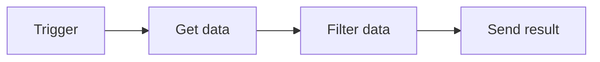
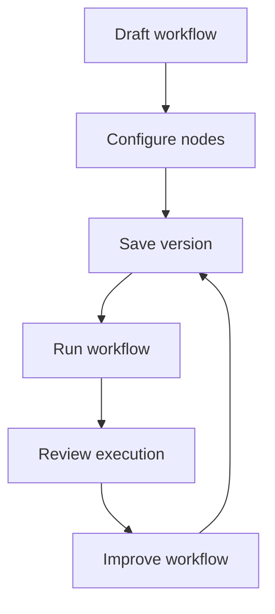

# How Rune Works

Rune workflows are visual automations. You build them by placing nodes on a canvas and connecting them in the order they should run.

## Core concepts

### Workflows

A workflow is the full automation: its name, description, nodes, connections, and saved versions.

Use a workflow for a repeatable task, such as checking an API, transforming a list, sending an email, or routing work based on conditions.

If you are running Rune locally for the first time, start with [Installation](/docs/getting-started). If Rune is already running, start with [Quick Start](/docs/getting-started/quick-start).

### Triggers

A trigger starts a workflow.

Rune includes:

- **Manual Trigger** for workflows you start yourself.
- **Scheduled Trigger** for workflows that run on an interval.
- **Webhook Trigger** for workflows that start when another service sends an event.

### Nodes

Nodes are the steps inside a workflow. A node might call an API, filter data, send an email, wait, branch, or ask an AI agent to respond.

Most nodes have inputs, outputs, and settings you edit in the inspector.

### Connections

Connections tell Rune what should happen next.

### Data and variables

When a node runs, it can produce output. Later nodes can use that output with variable references.

For example, a Log node can include the body returned by an HTTP Request node.

### Credentials

Credentials store secrets, tokens, and account connections. Use them when a workflow needs to call a private API or service.

Rune keeps credential values out of the workflow graph so you can reuse and share workflows more safely.

### Executions

An execution is one run of a workflow.

Use executions to answer:

- Did the workflow finish?
- Which node failed?
- What data did a node receive or return?
- When did the run happen?

### Templates

Templates are reusable workflow starting points. Use them when you want a proven shape and plan to customize it.

### Smith and Scryb

**Smith** helps you build workflows from plain-language prompts.

**Scryb** generates Markdown documentation for saved workflows so you can explain what a workflow does and how it is wired.

## Workflow lifecycle

## What to read next

- [Quick Start](/docs/getting-started/quick-start) for a first run.
- [Creating Workflows](/docs/guides/creating-workflows) for canvas habits.
- [Executions](/docs/guides/executions) for run history and failures.
