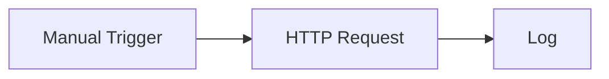

# Rune Documentation

Rune helps you build automations as workflows: connect a trigger, add steps, run the workflow, and watch what happened.

These docs are written for people using the Rune app. You do not need to know the backend, deployment setup, or generated code to get started.

## Start here

1. Open **Getting Started** to learn the main areas of the app.
2. Follow the **Quick Start** to run a workflow that does not require credentials.
3. Use the **Guides** when you want to connect services, work with data, use templates, or understand failed runs.

## What you can do with Rune

- Build workflows from scratch on a visual canvas.
- Start faster from templates.
- Ask Smith to draft a workflow from a plain-language prompt.
- Connect APIs and services with credentials.
- Monitor executions and inspect each run.
- Use Scryb to generate Markdown documentation for a saved workflow.

## The first workflow

The fastest path is a no-credential demo:

It calls a public API, logs the response, and gives you a feel for how data moves through Rune.

Continue with [Quick Start](/docs/getting-started/quick-start).
