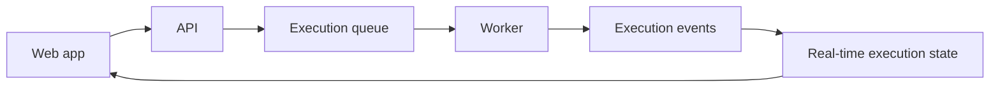

# Architecture

This page is for developers and operators who need implementation context.

User onboarding starts at [Rune Documentation](/docs).

## System overview

Rune is composed of:

- A Next.js web app for the user interface and workflow canvas.
- A FastAPI service for users, workflows, credentials, templates, OAuth, and internal endpoints.
- A Go worker that executes workflow nodes.
- A Rust real-time execution service for execution state and live updates.
- Python services for completion recording and scheduled workflow polling.
- A language-neutral DSL that defines workflow structures shared across services.

## User-facing path

From a user's point of view:

For repository-level implementation guidance, see `AGENTS.md` and the service READMEs.
