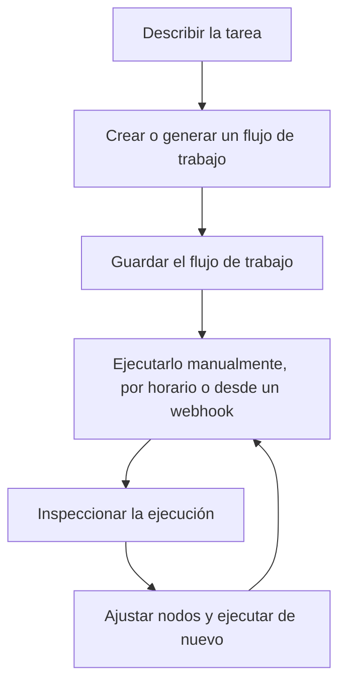

# Instalación

Usa esta página cuando necesites ejecutar Rune tú mismo. Si alguien ya te ha dado acceso a un espacio de trabajo de Rune, puedes ir directamente al [Inicio rápido](/docs/getting-started/quick-start).

El proceso de instalación que se describe a continuación sigue el README del proyecto.

## Ejecutar Rune con Docker

La forma más rápida de poner Rune en marcha en local es con Docker:

```bash
git clone https://github.com/rune-org/rune.git
cd rune

cp .env.example .env
make up
```

Cuando los contenedores estén en ejecución, abre:

```text
http://localhost:3000
```

## Qué se inicia

`make up` inicia la pila completa de Rune:

| Servicio | Puerto | Función |
| --- | --- | --- |
| Frontend | `3000` | Aplicación web y lienzo de flujo de trabajo |
| API | `8000` | API REST para autenticación, flujos de trabajo, credenciales, plantillas y orquestación |
| RTES | `8080` | Transmisión de ejecución en tiempo real |
| Worker | N/A | Motor de ejecución de flujos en segundo plano |
| Archivist | N/A | Registrador de completados y mantenedor de datos |
| Scheduler | N/A | Servicio de disparo de flujos programados |
| PostgreSQL | `5432` | Base de datos principal |
| MongoDB | `27017` | Historial de ejecuciones |
| Redis | `6379` | Estado y caché |
| RabbitMQ | `5672` / `15672` | Intermediario de mensajes |
| OpenObserve | `5080` | Plataforma de observabilidad |
| OpenTelemetry | `4317` / `4318` | Recolector de telemetría |

## Detener Rune

Desde la raíz del repositorio, ejecuta:

```bash
make down
```

## Después de la instalación

Una vez que la aplicación web se abre, el flujo del producto se ve así:



Pasos siguientes:

1. Sigue el [Inicio rápido](/docs/getting-started/quick-start).
2. Lee [Cómo funciona Rune](/docs/how-rune-works) cuando un término no te resulte familiar.
3. Usa [Familias de nodos](/docs/guides/nodes) para elegir el tipo de paso adecuado.
4. Añade [Credenciales](/docs/guides/credentials) cuando tu flujo necesite servicios privados.
