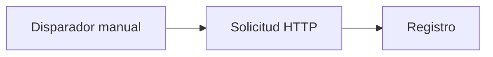

# Inicio rápido

Crea y ejecuta tu primer flujo de trabajo sin configurar cuentas externas.

Crearás este flujo:



## 1. Crear un flujo de trabajo

1. Abre **Crear**.
2. Elige **Empezar desde cero**.
3. Si se te pide, nombra el flujo de trabajo algo como `First API Demo`.

## 2. Añadir el disparador

Todo flujo de trabajo empieza con un disparador.

Usa un **Disparador manual** para esta demo. Te permite iniciar el flujo tú mismo cuando estés listo.

## 3. Añadir un nodo de Solicitud HTTP

Añade un nodo **Solicitud HTTP** y conéctalo al Disparador manual.

Configúralo con:

- **Método:** `GET`
- **URL:** `https://api.github.com/zen`
- **Tiempo de espera:** mantén el valor predeterminado a menos que tengas razón para cambiarlo.

Este punto de acceso público devuelve una respuesta de texto corta, por lo que es útil para aprender sin credenciales.

## 4. Añadir un nodo de Registro

Añade un nodo **Registro** y conéctalo al nodo de Solicitud HTTP.

Establece el mensaje en:

```text
GitHub Zen says: $HTTP.body
```

Si renombraste el nodo HTTP, usa ese nombre de nodo en la referencia de variable.

## 5. Guardar y ejecutar

1. Guarda el flujo de trabajo.
2. Haz clic en **Ejecutar**.
3. Espera a que termine la ejecución.

## 6. Inspeccionar el resultado

Abre los detalles de ejecución desde el lienzo o la página **Ejecuciones**.

Busca:

- El estado de la Solicitud HTTP.
- El cuerpo de respuesta de la API pública.
- La salida del nodo de Registro.

## Qué aprendiste

- Un disparador inicia el flujo de trabajo.
- Los nodos hacen el trabajo.
- Las conexiones deciden el orden.
- Los nodos posteriores pueden usar datos de los nodos anteriores.
- Las ejecuciones muestran lo que ocurrió durante un run.

A continuación, lee [Cómo funciona Rune](/docs/how-rune-works) o explora las [Familias de nodos](/docs/guides/nodes).
