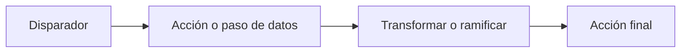

# Crear flujos de trabajo

Crea un flujo de trabajo cuando tengas una tarea que quieras que Rune repita.

## Elegir un punto de partida

Rune te ofrece tres puntos de inicio comunes:

- **Empezar desde cero** cuando conoces los pasos que quieres.
- **Usar una plantilla** cuando ya existe un flujo similar.
- **Pedir a un agente** cuando quieres que Smith redacte la primera versión a partir de una instrucción.

## Construir en el lienzo

El lienzo es donde organizas los nodos y los conectas.

1. Añade un disparador.
2. Añade la primera acción o paso de datos.
3. Conecta el disparador a ese paso.
4. Sigue añadiendo nodos hasta que el flujo alcance su objetivo.
5. Guarda antes de ejecutar.



## Nombrar los nodos con claridad

Los nombres cortos facilitan la lectura de las variables más adelante.

Buenos nombres de nodos:

- `Get customer`
- `Filter overdue invoices`
- `Send summary`

Evita nombres como `HTTP 1` o `Step 2` una vez que el flujo empiece a crecer.

## Guardar y versionar con frecuencia

Guarda antes de ejecutar, y vuelve a guardar después de ediciones significativas.

Si otro editor cambia el flujo mientras estás trabajando, Rune puede pedirte que resuelvas el conflicto de versión antes de guardar.

## Ejecutar en pequeño, luego expandir

Para un flujo nuevo:

1. Ejecuta con un caso de prueba pequeño.
2. Inspecciona la ejecución.
3. Corrige un problema a la vez.
4. Añade el siguiente nodo solo después de que el camino actual funcione.

Esto hace que los fallos sean más fáciles de entender.

## Cuándo usar Smith

Usa Smith cuando puedas describir el resultado pero no quieras ensamblar el primer grafo manualmente.

Ejemplo de instrucción:

```text
Build a workflow that receives a webhook, checks whether the payload has a high priority flag, and sends a Slack notification when it does.
```

Siempre revisa el flujo generado antes de usarlo para trabajo importante.
