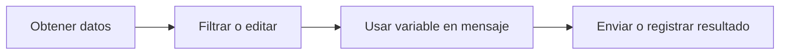

# Datos y variables

Los datos del flujo de trabajo se mueven de nodo en nodo. Cuando un nodo produce una salida, los nodos posteriores pueden usarla.

## Cómo se ven los datos

Los distintos nodos devuelven formas diferentes:

- Una Solicitud HTTP puede devolver un estado, encabezados y cuerpo.
- Un nodo Filter devuelve los elementos que coinciden.
- Un nodo Agent devuelve una respuesta.
- Un nodo Log registra un mensaje.

Usa los detalles de ejecución para ver la salida real de un nodo después de un run.

## Referencias de variables

Usa variables cuando un nodo posterior necesite datos de un nodo anterior.

Ejemplo:

```text
The API returned: $GetData.body
```

El nombre exacto de la variable depende de la etiqueta del nodo. Las etiquetas claras hacen más fácil leer las referencias de variables.

## Hábitos prácticos

- Renombra los nodos importantes antes de referenciar su salida.
- Ejecuta después de cada nuevo paso de datos para poder inspeccionar la forma.
- Usa nodos Log mientras construyes para hacer visibles los datos ocultos.
- Mantén los datos de prueba pequeños hasta que el flujo se comporte correctamente.

## Patrón común



## Solución de problemas con variables

Si una variable no se resuelve:

1. Confirma que el nodo ascendente se ejecutó correctamente.
2. Verifica la etiqueta del nodo usada en la variable.
3. Inspecciona la salida de ejecución para encontrar el nombre del campo.
4. Añade temporalmente un nodo Log para imprimir el valor.
