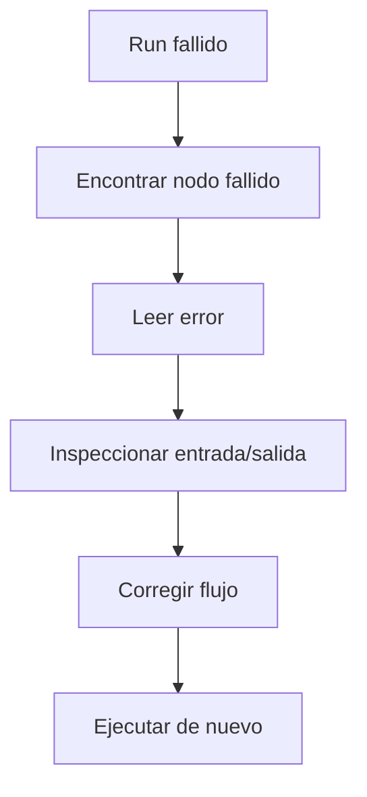

# Monitoreo de ejecuciones

Una ejecución es una corrida de un flujo de trabajo.

Usa las ejecuciones para ver si el flujo terminó, dónde falló y qué produjo cada nodo.

## Dónde encontrar las ejecuciones

Puedes revisar las ejecuciones desde:

- El lienzo del flujo de trabajo después de un run.
- La página **Ejecuciones**, que lista los runs recientes de todos los flujos.
- Los enlaces desde las filas del flujo o el historial de runs.

## Conceptos básicos de estado

Los estados de ejecución comunes incluyen:

- **En ejecución:** Rune todavía está procesando el flujo.
- **Completado:** el flujo terminó con éxito.
- **Fallido:** uno o más nodos detuvieron el run.

## Depurar un run fallido

1. Abre la ejecución fallida.
2. Encuentra el primer nodo que falló.
3. Lee el error del nodo.
4. Inspecciona la entrada y salida alrededor de ese nodo.
5. Corrige el flujo o la credencial.
6. Guarda y ejecuta de nuevo.

## Usar registros mientras construyes

Añade nodos Log cuando quieras ver valores durante un run.

Los registros son especialmente útiles mientras aprendes referencias de variables o verificas datos de una respuesta de API.

## Causas comunes de fallos

- Una credencial está faltante, expirada o ya no compartida.
- Una URL, campo o nombre de variable es incorrecto.
- Una API devolvió un estado 4xx o 5xx.
- Una condición de rama no coincidió con los datos esperados.
- Un flujo fue editado pero no guardado antes de ejecutar.
