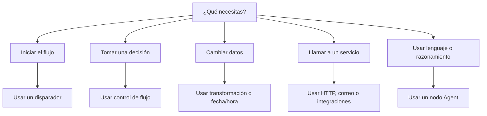

# Familias de nodos

Los nodos son los bloques de construcción de un flujo de trabajo de Rune. Esta guía explica las principales familias de nodos y cuándo usarlos.

## Disparadores

Los disparadores inician los flujos de trabajo.

- **Disparador manual:** ejecuta el flujo tú mismo.
- **Disparador programado:** ejecuta de forma repetida en un intervalo.
- **Disparador webhook:** inicia desde un evento HTTP externo.

La mayoría de los flujos de trabajo empiezan con un disparador al comienzo del flujo.

## Control de flujo

Los nodos de flujo deciden qué sucede a continuación.

- **If:** se divide en caminos verdadero y falso.
- **Switch:** enruta según múltiples reglas.
- **Wait:** pausa antes de continuar.
- **Merge:** reúne las ramas.
- **Log:** escribe salida útil durante un run.

Usa el control de flujo cuando el flujo de trabajo necesite decisiones, retrasos o salida de depuración.

## Transformación

Los nodos de transformación remodelan los datos antes de que otro paso los use.

- **Edit:** crear o cambiar campos.
- **Filter:** conservar solo los elementos que coincidan.
- **Sort:** ordenar una lista.
- **Limit:** conservar el primer conjunto de elementos.
- **Split:** procesar elementos uno por uno.
- **Aggregator:** recopilar elementos.

Usa los nodos de transformación entre fuentes de datos y acciones.

## Fecha y hora

Los nodos de fecha/hora crean, analizan, ajustan y formatean marcas de tiempo.

Úsalos para recordatorios, programaciones, fechas de vencimiento, informes y mensajes con conciencia de zona horaria.

## HTTP y correo electrónico

- **Solicitud HTTP:** llamar a una API.
- **Correo SMTP:** enviar un correo electrónico.

Estos nodos a menudo necesitan credenciales cuando el servicio de destino es privado.

## Agentes de IA

El nodo **Agent** puede usar un modelo, mensajes, herramientas y contexto para producir una respuesta.

Usa un Agent cuando un paso necesite comprensión del lenguaje, síntesis, redacción, clasificación o razonamiento flexible.

## Integraciones

Los nodos de integración se conectan a servicios como Google, Jira, Microsoft, Slack, Telegram y Dropbox cuando esas herramientas están disponibles en la aplicación.

Usa integraciones cuando quieras una acción específica de un servicio en lugar de una solicitud HTTP genérica.

## Notas

El nodo **Note** es para documentación en el lienzo. No se ejecuta ni cambia los datos del flujo de trabajo.

Usa notas para explicar ramas complicadas, supuestos o detalles de traspaso para tus compañeros.

## Elegir el nodo correcto

