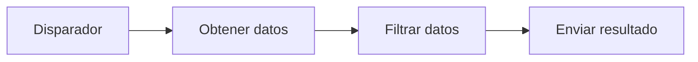
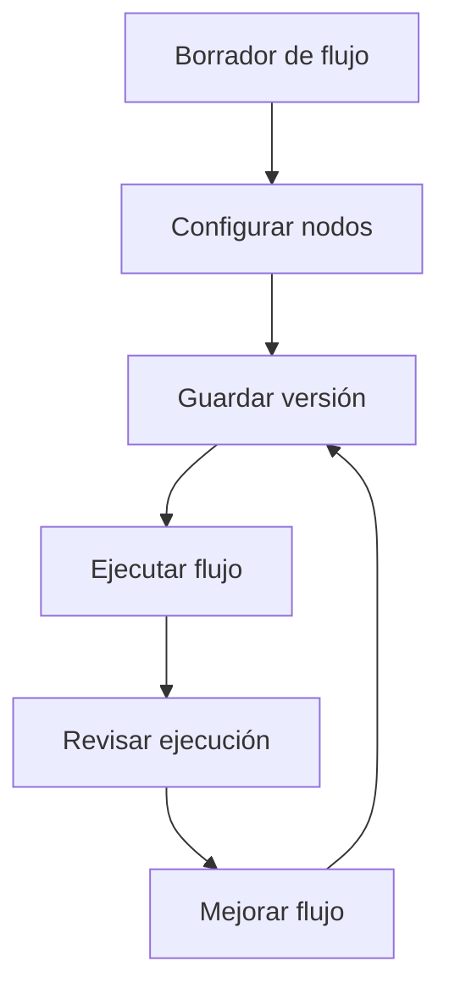

# Cómo funciona Rune

Los flujos de trabajo de Rune son automatizaciones visuales. Los construyes colocando nodos en un lienzo y conectándolos en el orden en que deben ejecutarse.

## Conceptos fundamentales

### Flujos de trabajo

Un flujo de trabajo es la automatización completa: su nombre, descripción, nodos, conexiones y versiones guardadas.

Usa un flujo de trabajo para una tarea repetible, como consultar una API, transformar una lista, enviar un correo electrónico o encaminar trabajo según condiciones.

Si ejecutas Rune en local por primera vez, empieza por la [Instalación](/docs/getting-started). Si Rune ya está en ejecución, empieza por el [Inicio rápido](/docs/getting-started/quick-start).

### Disparadores

Un disparador inicia un flujo de trabajo.

Rune incluye:

- **Disparador manual** para flujos de trabajo que inicias tú mismo.
- **Disparador programado** para flujos de trabajo que se ejecutan a intervalos.
- **Disparador webhook** para flujos de trabajo que se inician cuando otro servicio envía un evento.

### Nodos

Los nodos son los pasos dentro de un flujo de trabajo. Un nodo puede llamar a una API, filtrar datos, enviar un correo electrónico, esperar, ramificarse o pedir a un agente de IA que responda.

La mayoría de los nodos tienen entradas, salidas y configuraciones que editas en el inspector.

### Conexiones

Las conexiones le indican a Rune qué debe suceder a continuación.

### Datos y variables

Cuando un nodo se ejecuta, puede producir una salida. Los nodos posteriores pueden usar esa salida con referencias de variables.

Por ejemplo, un nodo de Registro puede incluir el cuerpo devuelto por un nodo de Solicitud HTTP.

### Credenciales

Las credenciales almacenan secretos, tokens y conexiones de cuentas. Úsalas cuando un flujo de trabajo necesite llamar a una API o servicio privado.

Rune mantiene los valores de las credenciales fuera del grafo del flujo de trabajo para que puedas reutilizar y compartir flujos de manera más segura.

### Ejecuciones

Una ejecución es una corrida de un flujo de trabajo.

Usa las ejecuciones para responder:

- ¿Terminó el flujo de trabajo?
- ¿Qué nodo falló?
- ¿Qué datos recibió o devolvió un nodo?
- ¿Cuándo ocurrió la corrida?

### Plantillas

Las plantillas son puntos de partida reutilizables para flujos de trabajo. Úsalas cuando quieras una estructura probada que planeas personalizar.

### Smith y Scryb

**Smith** te ayuda a construir flujos de trabajo a partir de descripciones en lenguaje natural.

**Scryb** genera documentación Markdown para flujos de trabajo guardados para que puedas explicar qué hace un flujo y cómo está conectado.

## Ciclo de vida de un flujo de trabajo

## Qué leer a continuación

- [Inicio rápido](/docs/getting-started/quick-start) para una primera ejecución.
- [Crear flujos de trabajo](/docs/guides/creating-workflows) para hábitos en el lienzo.
- [Ejecuciones](/docs/guides/executions) para el historial de corridas y fallos.
