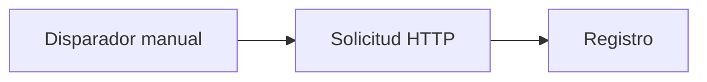

# Documentación de Rune

Rune te ayuda a crear automatizaciones como flujos de trabajo: conecta un disparador, añade pasos, ejecuta el flujo y observa lo que ocurrió.

Esta documentación está escrita para personas que usan la aplicación Rune. No necesitas conocer el backend, la configuración de despliegue ni el código generado para empezar.

## Empieza aquí

1. Si necesitas ejecutar Rune tú mismo, empieza por la [Instalación](/docs/getting-started).
2. Si Rune ya está disponible para ti, sigue el [Inicio rápido](/docs/getting-started/quick-start) para ejecutar un flujo que no requiere credenciales.
3. Usa las [Guías](/docs/guides/creating-workflows) cuando quieras conectar servicios, trabajar con datos, usar plantillas o entender ejecuciones fallidas.

## Qué puedes hacer con Rune

- Crear flujos de trabajo desde cero en un lienzo visual.
- Empezar más rápido con plantillas.
- Pedir a Smith que redacte un flujo a partir de una descripción en lenguaje natural.
- Conectar APIs y servicios con credenciales.
- Monitorear ejecuciones e inspeccionar cada ejecución.
- Usar Scryb para generar documentación Markdown de un flujo guardado.

## El primer flujo de trabajo

El camino más rápido es una demo sin credenciales:

Llama a una API pública, registra la respuesta y te da una idea de cómo se mueven los datos a través de Rune.

Continúa con el [Inicio rápido](/docs/getting-started/quick-start).
