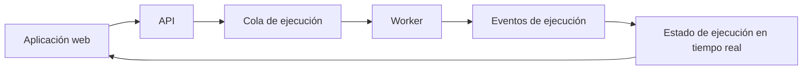

# Arquitectura

Esta página es para desarrolladores y operadores que necesitan contexto de implementación.

La incorporación de usuarios comienza en la [Documentación de Rune](/docs).

## Visión general del sistema

Rune está compuesto por:

- Una aplicación web Next.js para la interfaz de usuario y el lienzo de flujo de trabajo.
- Un servicio FastAPI para usuarios, flujos de trabajo, credenciales, plantillas, OAuth y endpoints internos.
- Un worker Go que ejecuta los nodos del flujo de trabajo.
- Un servicio de ejecución en tiempo real en Rust para el estado de ejecución y actualizaciones en vivo.
- Servicios Python para el registro de completados y el polling de flujos planificados.
- Un DSL neutral respecto al lenguaje que define las estructuras de flujo compartidas entre servicios.

## Ruta del lado del usuario

Desde el punto de vista del usuario:

Para orientación de implementación a nivel de repositorio, consulta `AGENTS.md` y los README de los servicios.
