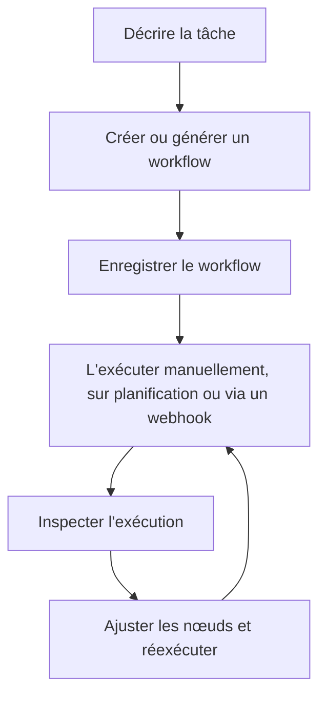

# Installation

Utilisez cette page lorsque vous devez exécuter Rune vous-même. Si quelqu'un vous a déjà donné accès à un espace de travail Rune, vous pouvez passer directement au [Démarrage rapide](/docs/getting-started/quick-start).

Le chemin d'installation ci-dessous suit le README du projet.

## Exécuter Rune avec Docker

Le moyen le plus rapide de faire fonctionner Rune en local est d'utiliser Docker :

```bash
git clone https://github.com/rune-org/rune.git
cd rune

cp .env.example .env
make up
```

Une fois les conteneurs en cours d'exécution, ouvrez :

```text
http://localhost:3000
```

## Ce qui démarre

`make up` démarre l'ensemble de la pile Rune :

| Service | Port | Rôle |
| --- | --- | --- |
| Frontend | `3000` | Application web et canevas de workflow |
| API | `8000` | API REST pour l'authentification, les workflows, les identifiants, les modèles et l'orchestration |
| RTES | `8080` | Diffusion d'exécution en temps réel |
| Worker | N/A | Moteur d'exécution de workflows en arrière-plan |
| Archivist | N/A | Enregistreur d'achèvement et gestionnaire de données |
| Scheduler | N/A | Service de déclenchement des workflows planifiés |
| PostgreSQL | `5432` | Base de données principale |
| MongoDB | `27017` | Historique des exécutions |
| Redis | `6379` | État et mise en cache |
| RabbitMQ | `5672` / `15672` | Courtier de messages |
| OpenObserve | `5080` | Plateforme d'observabilité |
| OpenTelemetry | `4317` / `4318` | Collecteur de télémétrie |

## Arrêter Rune

Depuis la racine du dépôt, exécutez :

```bash
make down
```

## Après l'installation

Une fois l'application web ouverte, le flux du produit ressemble à ceci :



Étapes suivantes :

1. Suivez le [Démarrage rapide](/docs/getting-started/quick-start).
2. Lisez [Comment fonctionne Rune](/docs/how-rune-works) lorsqu'un terme vous semble peu familier.
3. Utilisez les [Familles de nœuds](/docs/guides/nodes) pour choisir le bon type d'étape.
4. Ajoutez des [Identifiants](/docs/guides/credentials) lorsque votre workflow a besoin de services privés.
