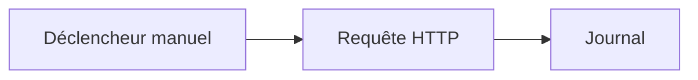

# Démarrage rapide

Créez et exécutez votre premier workflow sans configurer de compte externe.

Vous allez créer ce flux :



## 1. Créer un workflow

1. Ouvrez **Créer**.
2. Choisissez **Partir de zéro**.
3. Si vous y êtes invité, nommez le workflow par exemple `First API Demo`.

## 2. Ajouter le déclencheur

Chaque workflow commence par un déclencheur.

Utilisez un **Déclencheur manuel** pour cette démo. Il vous permet de démarrer le workflow vous-même quand vous êtes prêt.

## 3. Ajouter un nœud Requête HTTP

Ajoutez un nœud **Requête HTTP** et reliez-y le Déclencheur manuel.

Configurez-le avec :

- **Méthode :** `GET`
- **URL :** `https://api.github.com/zen`
- **Délai d'expiration :** conservez la valeur par défaut sauf raison particulière de la modifier.

Ce point de terminaison public renvoie une courte réponse texte, ce qui est utile pour apprendre sans identifiants.

## 4. Ajouter un nœud Journal

Ajoutez un nœud **Journal** et reliez-y le nœud Requête HTTP.

Définissez le message sur :

```text
GitHub Zen says: $HTTP.body
```

Si vous avez renommé le nœud HTTP, utilisez ce nom de nœud dans la référence de variable.

## 5. Enregistrer et exécuter

1. Enregistrez le workflow.
2. Cliquez sur **Exécuter**.
3. Attendez la fin de l'exécution.

## 6. Inspecter le résultat

Ouvrez les détails de l'exécution depuis le canevas ou la page **Exécutions**.

Recherchez :

- Le statut de la Requête HTTP.
- Le corps de la réponse de l'API publique.
- La sortie du nœud Journal.

## Ce que vous avez appris

- Un déclencheur démarre le workflow.
- Les nœuds font le travail.
- Les connexions décident de l'ordre.
- Les nœuds suivants peuvent utiliser les données des nœuds précédents.
- Les exécutions montrent ce qui s'est passé pendant un run.

Ensuite, lisez [Comment fonctionne Rune](/docs/how-rune-works) ou explorez les [Familles de nœuds](/docs/guides/nodes).
