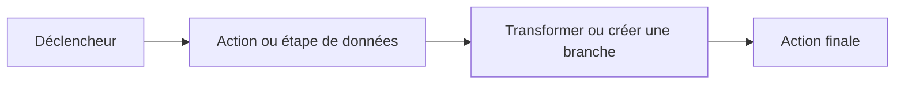

# Créer des workflows

Créez un workflow lorsque vous avez une tâche que vous voulez que Rune répète.

## Choisir un point de départ

Rune propose trois départs courants :

- **Partir de zéro** lorsque vous connaissez les étapes que vous voulez.
- **Utiliser un modèle** lorsqu'un workflow similaire existe déjà.
- **Demander à un agent** lorsque vous voulez que Smith rédige la première version à partir d'une consigne.

## Construire sur le canevas

Le canevas est l'endroit où vous disposez les nœuds et les reliez.

1. Ajoutez un déclencheur.
2. Ajoutez la première action ou étape de données.
3. Reliez le déclencheur à cette étape.
4. Continuez d'ajouter des nœuds jusqu'à ce que le workflow atteigne son objectif.
5. Enregistrez avant d'exécuter.



## Nommer les nœuds clairement

Des noms courts facilitent la lecture des variables par la suite.

Bons noms de nœuds :

- `Get customer`
- `Filter overdue invoices`
- `Send summary`

Évitez des noms comme `HTTP 1` ou `Step 2` dès que le workflow commence à grandir.

## Enregistrer et versionner souvent

Enregistrez avant d'exécuter, et enregistrez à nouveau après des modifications importantes.

Si un autre éditeur modifie le workflow pendant que vous travaillez, Rune peut vous demander de résoudre le conflit de version avant d'enregistrer.

## Exécuter petit, puis étendre

Pour un nouveau workflow :

1. Exécutez avec un petit cas de test.
2. Inspectez l'exécution.
3. Corrigez un problème à la fois.
4. N'ajoutez le nœud suivant qu'une fois le chemin actuel fonctionnel.

Cela rend les échecs plus faciles à comprendre.

## Quand utiliser Smith

Utilisez Smith lorsque vous pouvez décrire le résultat mais ne voulez pas assembler le premier graphe manuellement.

Exemple de consigne :

```text
Build a workflow that receives a webhook, checks whether the payload has a high priority flag, and sends a Slack notification when it does.
```

Vérifiez toujours le workflow généré avant de l'utiliser pour un travail important.
