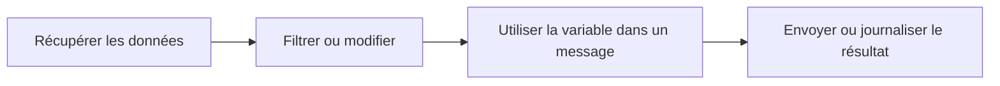

# Données et variables

Les données d'un workflow circulent de nœud en nœud. Lorsqu'un nœud produit une sortie, les nœuds suivants peuvent l'utiliser.

## À quoi ressemblent les données

Différents nœuds renvoient des formes différentes :

- Une Requête HTTP peut renvoyer un statut, des en-têtes et un corps.
- Un nœud Filter renvoie les éléments correspondants.
- Un nœud Agent renvoie une réponse.
- Un nœud Journal enregistre un message.

Utilisez les détails d'exécution pour voir la sortie réelle d'un nœud après un run.

## Références de variables

Utilisez des variables lorsqu'un nœud suivant a besoin des données d'un nœud précédent.

Exemple :

```text
The API returned: $GetData.body
```

Le nom exact de la variable dépend du libellé du nœud. Des libellés clairs facilitent la lecture des références de variables.

## Bonnes habitudes

- Renommez les nœuds importants avant de référencer leur sortie.
- Exécutez après chaque nouvelle étape de données pour pouvoir en inspecter la forme.
- Utilisez des nœuds Journal pendant la construction pour rendre visibles les données cachées.
- Gardez les données de test petites jusqu'à ce que le workflow se comporte correctement.

## Schéma courant



## Dépannage des variables

Si une variable ne se résout pas :

1. Vérifiez que le nœud en amont s'est exécuté avec succès.
2. Vérifiez le libellé du nœud utilisé dans la variable.
3. Inspectez la sortie d'exécution pour trouver le nom du champ.
4. Ajoutez temporairement un nœud Journal pour afficher la valeur.
