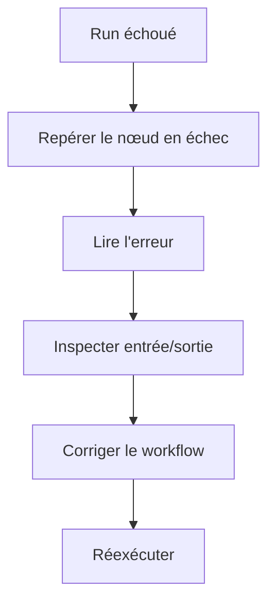

# Surveillance des exécutions

Une exécution est un run d'un workflow.

Utilisez les exécutions pour voir si le workflow s'est terminé, où il a échoué et ce que chaque nœud a produit.

## Où trouver les exécutions

Vous pouvez consulter les exécutions depuis :

- Le canevas du workflow après un run.
- La page **Exécutions**, qui répertorie les runs récents de tous les workflows.
- Les liens depuis les lignes de workflow ou l'historique des runs.

## Bases des statuts

Les états d'exécution courants incluent :

- **En cours :** Rune travaille encore sur le workflow.
- **Terminé :** le workflow s'est terminé avec succès.
- **Échoué :** un ou plusieurs nœuds ont arrêté le run.

## Déboguer un run échoué

1. Ouvrez l'exécution échouée.
2. Repérez le premier nœud en échec.
3. Lisez l'erreur du nœud.
4. Inspectez l'entrée et la sortie autour de ce nœud.
5. Corrigez le workflow ou l'identifiant.
6. Enregistrez et réexécutez.

## Utiliser les journaux pendant la construction

Ajoutez des nœuds Journal lorsque vous voulez voir les valeurs pendant un run.

Les journaux sont particulièrement utiles lorsque vous apprenez les références de variables ou que vous vérifiez les données d'une réponse d'API.

## Causes courantes d'échec

- Un identifiant est manquant, expiré ou n'est plus partagé.
- Une URL, un champ ou un nom de variable est incorrect.
- Une API a renvoyé un statut 4xx ou 5xx.
- Une condition de branche ne correspondait pas aux données attendues.
- Un workflow a été modifié mais non enregistré avant l'exécution.
