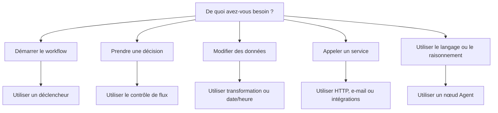

# Familles de nœuds

Les nœuds sont les composants de base d'un workflow Rune. Ce guide explique les principales familles de nœuds et quand les utiliser.

## Déclencheurs

Les déclencheurs démarrent les workflows.

- **Déclencheur manuel :** exécutez le workflow vous-même.
- **Déclencheur planifié :** exécutez-le de façon répétée à intervalles réguliers.
- **Déclencheur webhook :** démarrez à partir d'un événement HTTP externe.

La plupart des workflows commencent par un déclencheur placé au début du flux.

## Contrôle de flux

Les nœuds de flux décident de ce qui se passe ensuite.

- **If :** se divise en chemins vrai et faux.
- **Switch :** oriente selon plusieurs règles.
- **Wait :** met en pause avant de continuer.
- **Merge :** réunit les branches.
- **Log :** écrit une sortie utile pendant un run.

Utilisez le contrôle de flux lorsque le workflow a besoin de décisions, de délais ou d'une sortie de débogage.

## Transformation

Les nœuds de transformation remodèlent les données avant qu'une autre étape ne les utilise.

- **Edit :** créer ou modifier des champs.
- **Filter :** ne conserver que les éléments correspondants.
- **Sort :** trier une liste.
- **Limit :** ne conserver que le premier ensemble d'éléments.
- **Split :** traiter les éléments un par un.
- **Aggregator :** regrouper les éléments.

Utilisez les nœuds de transformation entre les sources de données et les actions.

## Date et heure

Les nœuds date/heure créent, analysent, ajustent et formatent les horodatages.

Utilisez-les pour les rappels, les plannings, les échéances, les rapports et les messages tenant compte du fuseau horaire.

## HTTP et e-mail

- **Requête HTTP :** appeler une API.
- **E-mail SMTP :** envoyer un e-mail.

Ces nœuds ont souvent besoin d'identifiants lorsque le service ciblé est privé.

## Agents IA

Le nœud **Agent** peut utiliser un modèle, des messages, des outils et un contexte pour produire une réponse.

Utilisez un Agent lorsqu'une étape nécessite une compréhension du langage, une synthèse, une rédaction, une classification ou un raisonnement flexible.

## Intégrations

Les nœuds d'intégration se connectent à des services tels que Google, Jira, Microsoft, Slack, Telegram et Dropbox lorsque ces outils sont disponibles dans l'application.

Utilisez les intégrations lorsque vous voulez une action spécifique à un service plutôt qu'une requête HTTP générique.

## Notes

Le nœud **Note** sert à la documentation sur le canevas. Il ne s'exécute pas et ne modifie pas les données du workflow.

Utilisez les notes pour expliquer les branches délicates, les hypothèses ou les détails de passation pour vos coéquipiers.

## Choisir le bon nœud

