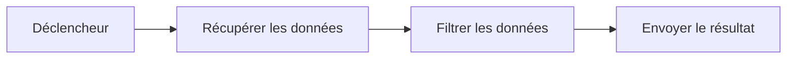
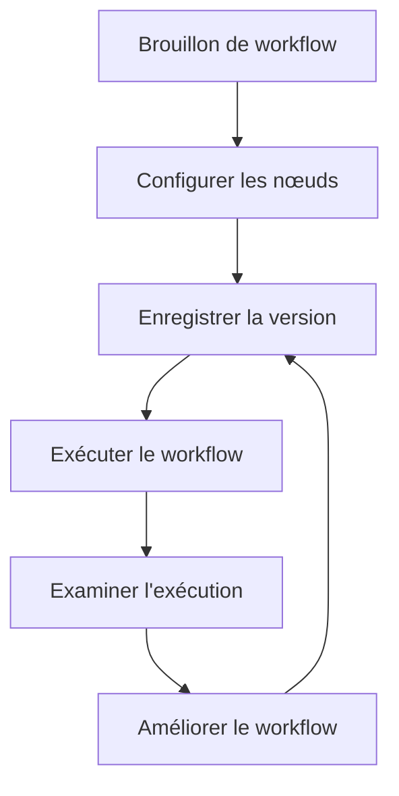

# Comment fonctionne Rune

Les workflows Rune sont des automatisations visuelles. Vous les construisez en plaçant des nœuds sur un canevas et en les reliant dans l'ordre où ils doivent s'exécuter.

## Concepts fondamentaux

### Workflows

Un workflow est l'automatisation complète : son nom, sa description, ses nœuds, ses connexions et ses versions enregistrées.

Utilisez un workflow pour une tâche répétable, comme interroger une API, transformer une liste, envoyer un e-mail ou orienter le travail en fonction de conditions.

Si vous exécutez Rune en local pour la première fois, commencez par l'[Installation](/docs/getting-started). Si Rune est déjà en cours d'exécution, commencez par le [Démarrage rapide](/docs/getting-started/quick-start).

### Déclencheurs

Un déclencheur démarre un workflow.

Rune inclut :

- **Déclencheur manuel** pour les workflows que vous démarrez vous-même.
- **Déclencheur planifié** pour les workflows qui s'exécutent à intervalles réguliers.
- **Déclencheur webhook** pour les workflows qui démarrent lorsqu'un autre service envoie un événement.

### Nœuds

Les nœuds sont les étapes d'un workflow. Un nœud peut appeler une API, filtrer des données, envoyer un e-mail, attendre, créer une branche ou demander à un agent IA de répondre.

La plupart des nœuds ont des entrées, des sorties et des paramètres que vous modifiez dans l'inspecteur.

### Connexions

Les connexions indiquent à Rune ce qui doit se passer ensuite.

### Données et variables

Lorsqu'un nœud s'exécute, il peut produire une sortie. Les nœuds suivants peuvent utiliser cette sortie à l'aide de références de variables.

Par exemple, un nœud Journal peut inclure le corps renvoyé par un nœud Requête HTTP.

### Identifiants

Les identifiants stockent les secrets, les jetons et les connexions de compte. Utilisez-les lorsqu'un workflow doit appeler une API ou un service privé.

Rune conserve les valeurs des identifiants en dehors du graphe du workflow afin que vous puissiez réutiliser et partager les workflows en toute sécurité.

### Exécutions

Une exécution est un run d'un workflow.

Utilisez les exécutions pour répondre à :

- Le workflow s'est-il terminé ?
- Quel nœud a échoué ?
- Quelles données un nœud a-t-il reçues ou renvoyées ?
- Quand le run a-t-il eu lieu ?

### Modèles

Les modèles sont des points de départ de workflow réutilisables. Utilisez-les lorsque vous voulez une structure éprouvée que vous prévoyez de personnaliser.

### Smith et Scryb

**Smith** vous aide à créer des workflows à partir de consignes en langage naturel.

**Scryb** génère une documentation Markdown pour les workflows enregistrés afin que vous puissiez expliquer ce que fait un workflow et comment il est câblé.

## Cycle de vie d'un workflow

## À lire ensuite

- [Démarrage rapide](/docs/getting-started/quick-start) pour un premier run.
- [Créer des workflows](/docs/guides/creating-workflows) pour les bonnes habitudes sur le canevas.
- [Exécutions](/docs/guides/executions) pour l'historique des runs et les échecs.
