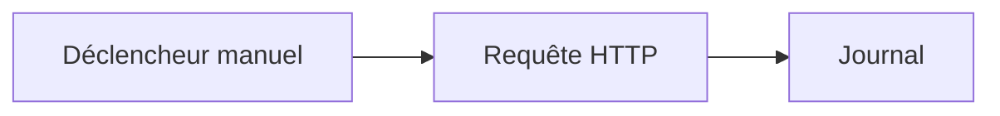

# Documentation Rune

Rune vous aide à créer des automatisations sous forme de workflows : reliez un déclencheur, ajoutez des étapes, exécutez le workflow et observez ce qui s'est passé.

Cette documentation s'adresse aux personnes qui utilisent l'application Rune. Vous n'avez pas besoin de connaître le backend, la configuration de déploiement ou le code généré pour démarrer.

## Commencez ici

1. Si vous devez exécuter Rune vous-même, commencez par l'[Installation](/docs/getting-started).
2. Si Rune est déjà disponible pour vous, suivez le [Démarrage rapide](/docs/getting-started/quick-start) pour exécuter un workflow qui ne nécessite aucun identifiant.
3. Utilisez les [Guides](/docs/guides/creating-workflows) lorsque vous souhaitez connecter des services, manipuler des données, utiliser des modèles ou comprendre des exécutions échouées.

## Ce que vous pouvez faire avec Rune

- Créer des workflows à partir de zéro sur un canevas visuel.
- Démarrer plus vite à partir de modèles.
- Demander à Smith de rédiger un workflow à partir d'une consigne en langage naturel.
- Connecter des API et des services à l'aide d'identifiants.
- Surveiller les exécutions et inspecter chaque run.
- Utiliser Scryb pour générer une documentation Markdown d'un workflow enregistré.

## Le premier workflow

Le chemin le plus rapide est une démo sans identifiant :

Il appelle une API publique, journalise la réponse et vous donne une idée de la façon dont les données circulent dans Rune.

Continuez avec le [Démarrage rapide](/docs/getting-started/quick-start).
