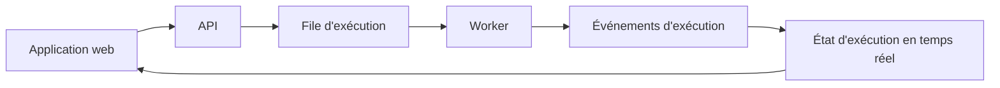

# Architecture

Cette page s'adresse aux développeurs et aux opérateurs qui ont besoin du contexte d'implémentation.

L'intégration des utilisateurs commence à la [Documentation Rune](/docs).

## Vue d'ensemble du système

Rune est composé de :

- Une application web Next.js pour l'interface utilisateur et le canevas de workflow.
- Un service FastAPI pour les utilisateurs, les workflows, les identifiants, les modèles, OAuth et les points de terminaison internes.
- Un worker Go qui exécute les nœuds de workflow.
- Un service d'exécution en temps réel en Rust pour l'état d'exécution et les mises à jour en direct.
- Des services Python pour l'enregistrement d'achèvement et le polling des workflows planifiés.
- Un DSL indépendant du langage qui définit les structures de workflow partagées entre les services.

## Parcours côté utilisateur

Du point de vue de l'utilisateur :

Pour des conseils d'implémentation au niveau du dépôt, consultez `AGENTS.md` et les README des services.
