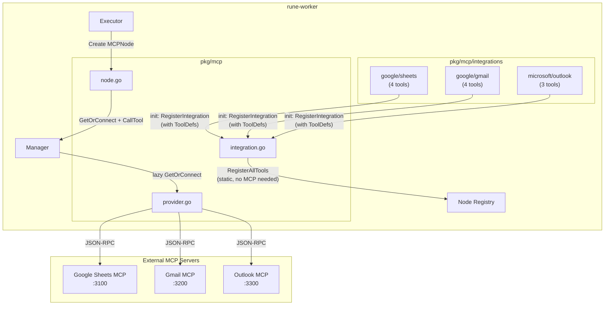
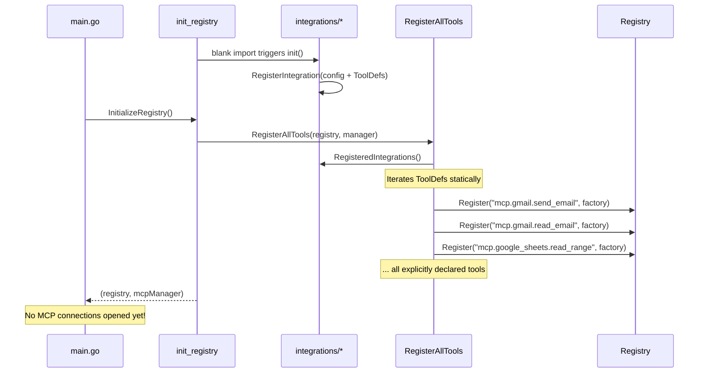
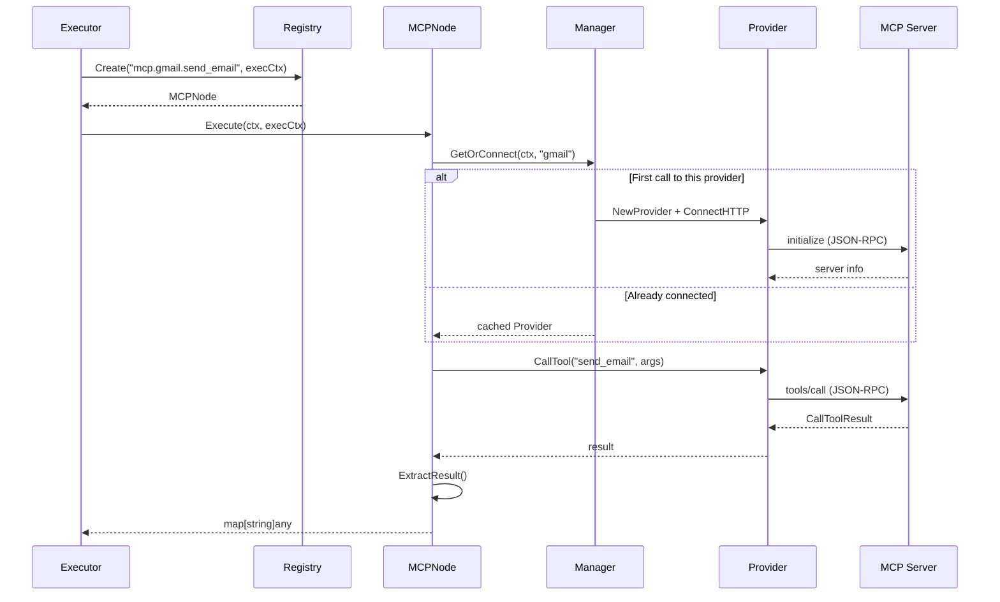

# MCP Integration Bridge

## Overview

The MCP bridge connects `rune-worker` to external MCP servers. Each integration
**explicitly declares** which tools it wraps via `ToolDef` entries. Tools are
registered as workflow nodes at startup — **no runtime auto-discovery**.
MCP connections are established **lazily** on first workflow execution.

## Architecture



## Startup Flow (No MCP Connections)



## Runtime Execution (Lazy Connection)



## File Structure

```
pkg/mcp/
├── integration.go                     # IntegrationConfig, ToolDef, RegisterAllTools
├── provider.go                        # MCP client wrapper: connect, discover, call
├── manager.go                         # Lazy connection manager (GetOrConnect)
├── node.go                            # MCPNode implementing plugin.Node
├── bridge_test.go                     # Integration tests with in-memory MCP server
└── integrations/
    ├── google/
    │   ├── sheets/sheets.go           # 4 tools: read_range, write_range, append_row, create_spreadsheet
    │   └── gmail/gmail.go             # 4 tools: send_email, read_email, search_emails, list_labels
    └── microsoft/
        └── outlook/outlook.go         # 3 tools: send_email, read_email, list_inbox
```

## How to Add an Integration

### Step 1: Discover tools from the MCP server (dev time only)

```bash
# Start the MCP server locally and inspect its tools
# This is a one-time dev step, NOT done at runtime
```

### Step 2: Create the integration package with explicit ToolDefs

```go
// pkg/mcp/integrations/slack/slack.go
package slack

import "rune-worker/pkg/mcp"

func init() {
    mcp.RegisterIntegration(mcp.IntegrationConfig{
        Name: "slack",
        URL:  "http://slack-mcp:3400/mcp",
        Tools: []mcp.ToolDef{
            {
                MCPName:     "send_message",
                Description: "Send a message to a Slack channel",
            },
            {
                MCPName:     "list_channels",
                Description: "List all Slack channels",
            },
            // Only wrap the tools you want to expose to users!
            // If the MCP server has 50 tools, you might only wrap 5.
        },
    })
}
```

### Step 3: Add the import

In `pkg/registry/init_registry.go`:

```go
_ "rune-worker/pkg/mcp/integrations/slack"
```

### Step 4: Custom node names (optional)

Use `NodeName` to override the default naming:

```go
{
    MCPName:     "send_message_v2",  // actual tool name on MCP server
    NodeName:    "send_message",     // becomes mcp.slack.send_message
    Description: "Send a message to a Slack channel",
},
```

## Multi-Provider Workflow

A single workflow can use nodes from different MCP servers:

```json
{
  "nodes": [
    {
      "id": "1",
      "type": "mcp.google_sheets.read_range",
      "parameters": {
        "spreadsheet_id": "abc123",
        "range": "Sheet1!A1:B10"
      }
    },
    {
      "id": "2",
      "type": "mcp.outlook.send_email",
      "parameters": {
        "to": "team@company.com",
        "subject": "Report",
        "body": "{{ $1.data }}"
      }
    }
  ]
}
```

## Connection Lifecycle

- **Startup**: No MCP connections. Tools registered statically from ToolDefs.
- **First execution**: `GetOrConnect` lazily connects to the MCP server when a workflow first uses a tool from that provider.
- **Subsequent executions**: Reuses the cached connection.
- **Shutdown**: `defer mcpManager.DisconnectAll()` in main.go closes all active sessions.

## Key Design Decisions

1. **No auto-discovery**: Tools must be explicitly declared in Go. This ensures the DSL generator knows all available tools at build time, and users only see curated tools.
2. **Lazy connections**: MCP servers don't need to be running at worker startup. Connection failures are scoped to the specific workflow execution, not the entire worker.
3. **Custom naming via NodeName**: The raw MCP tool name can differ from the workflow node name, allowing clean DSL types even when upstream APIs change.

## How to Test

```bash
# Run MCP bridge tests (in-memory server, no external deps)
go test ./pkg/mcp/... -v

# Run registry tests (verifies MCP tools are statically registered)
go test ./pkg/registry/... -v

# Run all tests
go test ./... -count=1
```

## SDK Coverage

| Feature | Used | Purpose |
|---------|------|---------|
| `Client` + `ClientSession` | ✅ | Session management |
| `StreamableClientTransport` | ✅ | HTTP transport to remote servers |
| `CallTool` / `CallToolParams` | ✅ | Tool execution |
| `Tools()` iterator | ✅ | Tool discovery (dev-time only) |
| `TextContent` | ✅ | Result parsing |
| `NewInMemoryTransports` | ✅ | Testing |
| `Server` + `AddTool` | ✅ | Test server |
| Resources / Prompts / Sampling | ❌ | Not needed for tool-based integrations |
| OAuth / Auth handlers | ❌ | Deferred to auth team |
