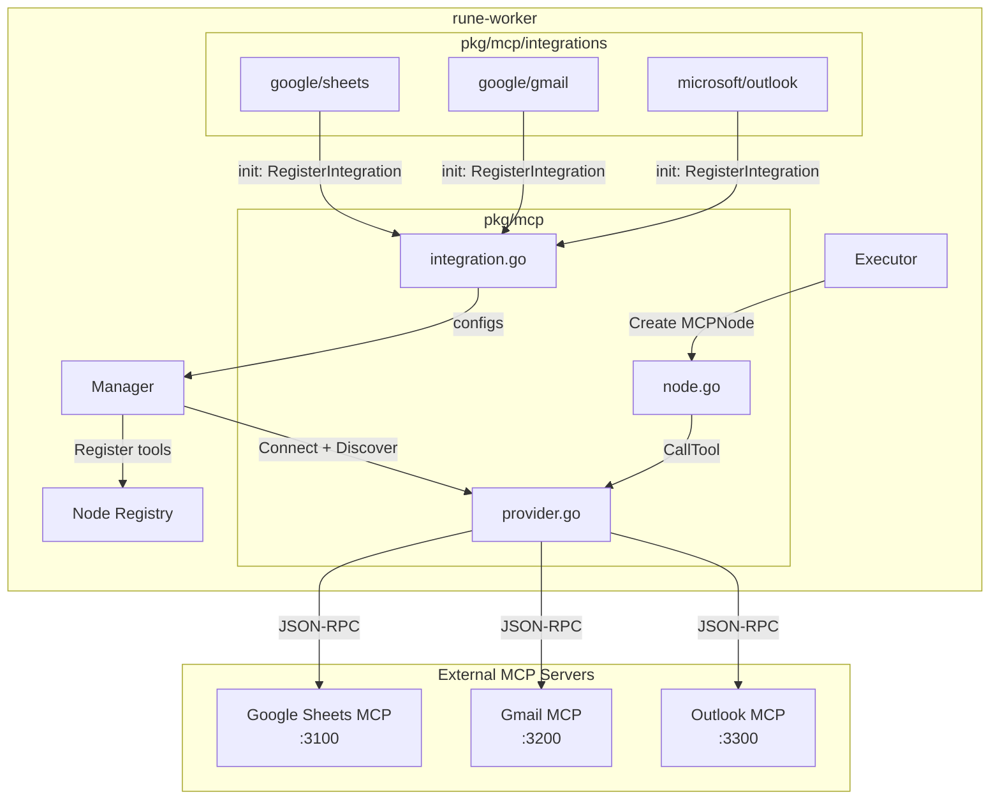
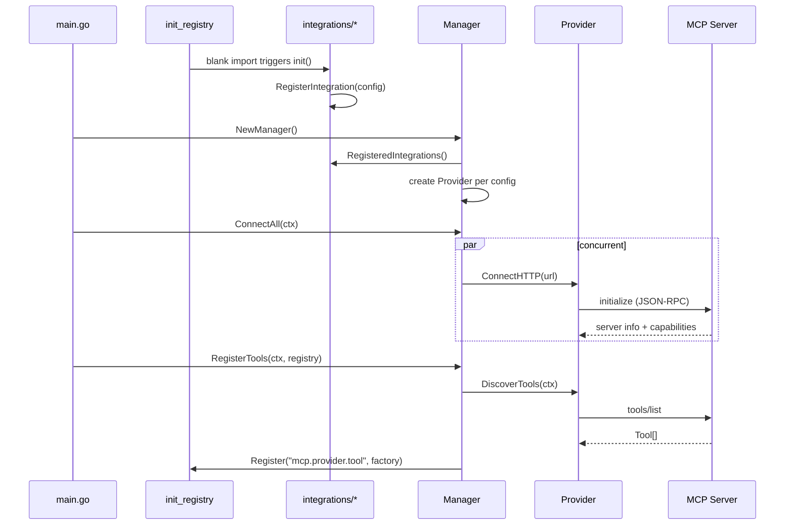
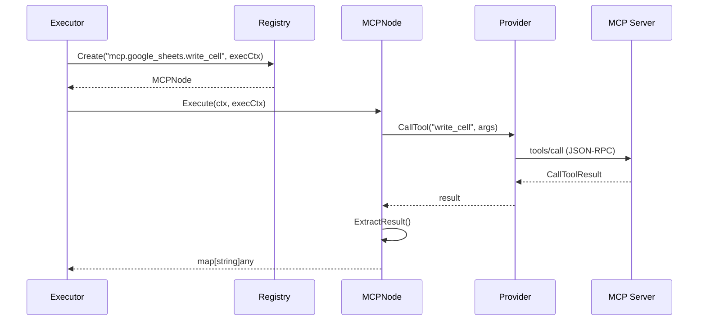

# MCP Integration Bridge

## Overview

The MCP bridge connects `rune-worker` to external MCP servers, auto-discovers their tools at startup, and registers each tool as a workflow node. Workflows can mix MCP nodes from different providers in the same execution.

## Architecture



## Startup Flow



## Runtime Execution



## File Structure

```
pkg/mcp/
├── integration.go                     # IntegrationConfig, RegisterIntegration(), NodeRegistry
├── provider.go                        # MCP client wrapper: connect, discover, call
├── manager.go                         # Pool of providers, concurrent connect, tool registration
├── node.go                            # MCPNode implementing plugin.Node
├── bridge_test.go                     # 10 integration tests with in-memory MCP server
└── integrations/
    ├── google/
    │   ├── sheets/sheets.go           # Google Sheets → http://google-sheets-mcp:3100/mcp
    │   └── gmail/gmail.go             # Gmail → http://gmail-mcp:3200/mcp
    └── microsoft/
        └── outlook/outlook.go         # Outlook → http://outlook-mcp:3300/mcp
```

## How to Add an Integration

1. Create the package:

```go
// pkg/mcp/integrations/slack/slack.go
package slack

import "rune-worker/pkg/mcp"

func init() {
    mcp.RegisterIntegration(mcp.IntegrationConfig{
        Name: "slack",
        URL:  "http://slack-mcp:3400/mcp",
    })
}
```

2. Add the import in `pkg/registry/init_registry.go`:

```go
_ "rune-worker/pkg/mcp/integrations/slack"
```

3. Deploy the Slack MCP server. All tools are auto-discovered and registered as `mcp.slack.*` nodes.

## Multi-Provider Workflow

A single workflow can use nodes from different MCP servers. Each node holds a reference to its provider, and connections are managed by the shared Manager. Credentials are passed as tool arguments — the MCP server handles auth per-request.

```json
{
  "nodes": [
    {
      "id": "1",
      "type": "mcp.google_sheets.read_range",
      "parameters": {
        "spreadsheet_id": "abc123",
        "range": "Sheet1!A1:B10"
      }
    },
    {
      "id": "2",
      "type": "mcp.outlook.send_email",
      "parameters": {
        "to": "team@company.com",
        "subject": "Report",
        "body": "{{ $1.data }}"
      }
    }
  ]
}
```

## Connection Lifecycle

- **Startup**: Manager connects to all registered MCP servers concurrently. Partial failures are tolerated — if Gmail MCP is down, Sheets and Outlook still work.
- **Runtime**: Connections are shared across workflow executions. Each `CallTool` is an independent JSON-RPC request over the persistent session.
- **Shutdown**: `defer mcpManager.DisconnectAll()` in main.go closes all sessions on `SIGTERM`.

## SDK Coverage

We use the `github.com/modelcontextprotocol/go-sdk/mcp` package. Here's what we use vs. what's available:

| Feature | Used | Purpose |
|---------|------|---------|
| `Client` + `ClientSession` | ✅ | Session management |
| `StreamableClientTransport` | ✅ | HTTP transport to remote servers |
| `CallTool` / `CallToolParams` | ✅ | Tool execution |
| `Tools()` iterator | ✅ | Tool discovery |
| `TextContent` | ✅ | Result parsing |
| `NewInMemoryTransports` | ✅ | Testing |
| `Server` + `AddTool` | ✅ | Test server |
| Resources / Prompts / Sampling | ❌ | Not needed for tool-based integrations |
| OAuth / Auth handlers | ❌ | Deferred to auth team |

## How to Test

```bash
# Run MCP bridge tests (in-memory server, no external deps)
go test ./pkg/mcp/... -v

# Run all tests
go test ./... -count=1
```

The tests spin up a real MCP server in-memory with `echo` and `add` tools, then verify the full pipeline: connect → discover → call → extract → MCPNode.Execute.

## How to Run

1. Ensure MCP servers are running at the URLs defined in each integration package.
2. Start the worker:

```bash
go run ./cmd/worker
```

3. The worker logs show which providers connected and how many tools were registered:

```
INFO mcp provider connected   provider=google_sheets server=sheets-server
INFO discovered mcp tools      provider=google_sheets count=30
INFO mcp provider connected   provider=outlook server=outlook-server
INFO discovered mcp tools      provider=outlook count=15
INFO mcp tools registered      count=45
INFO mcp integrations ready    tools=45 total_nodes=65
```

4. Workflows can now use `mcp.google_sheets.*` and `mcp.outlook.*` nodes.
